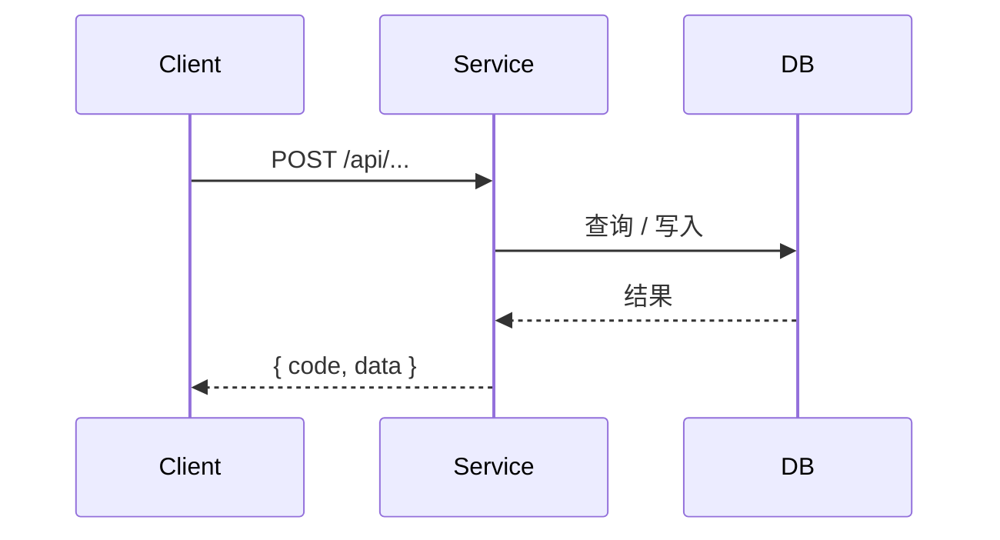

<!-- backendFlow api-tech 模板。章节用 HTML 注释标【必写】/【可选】。 -->
<!-- 标题禁止手写序号，飞书原生标题自动编号。生成正式文档时请删除本文件中的所有 HTML 注释。 -->

# 背景与目标
<!-- 【可选】 -->

说明本次后端要解决的问题与服务级目标。不写项目背景与技术栈罗列。

# 范围与非目标
<!-- 【可选】 -->

- 涉及的服务 / 模块。
- 明确不做的部分（非目标）。

# 接口设计
<!-- 【必写】 -->

统一约定：写明请求方法、`Content-Type`、统一返回体 `{ code, data, message }`、鉴权方式、时间字段单位等全局约定。

## <接口名称>

`POST /api/<module>/<action>` — 鉴权：<登录态 / 内部调用 / 开放>

入参（区分 path / query / body）：

| 位置 | 参数 | 类型 | 必填 | 默认 | 校验 | 说明 |
| --- | --- | --- | --- | --- | --- | --- |
| body | page | number | 否 | 1 | ≥ 1 | 页码 |
| body | keyword | string | 否 | — | ≤ 64 | 名称模糊搜索 |

出参（统一包裹 `{ code, data, message }`，`data` 结构见数据模型）：

```json
{
  "code": 0,
  "message": "ok",
  "data": { "total": 0, "list": [] }
}
```

错误码：

| code | 含义 | 触发条件 |
| --- | --- | --- |
| 0 | 成功 | — |
| 40001 | 参数校验失败 | 入参不满足校验规则 |
| 40301 | 登录态失效 | 无有效登录态 |

# 数据模型 / 数据库设计
<!-- 【必写】 -->

## <实体 / 表名>

| 字段 | 类型 | 必填 | 默认 / 约束 | 说明 |
| --- | --- | --- | --- | --- |
| id | string | 是 | 主键 | 唯一 ID |
| name | string | 是 | 长度 1–64 | 名称 |
| status | enum | 是 | ACTIVE / FROZEN | 状态 |
| createdAt | number | 是 | epoch ms | 创建时间 |

```typescript
interface Entity {
  id: string
  name: string
  status: 'ACTIVE' | 'FROZEN'
  createdAt: number // epoch ms
}
```

索引与 migration 影响：说明新增/变更的索引、唯一约束、迁移注意点。

# 核心流程 / 时序
<!-- 【必写】 -->

说明关键业务流程、调用链、事务边界与幂等 / 并发处理。



# 依赖与非功能性
<!-- 【可选】 -->

- 中间件 / 第三方 / MQ / 缓存。
- 限流、性能、安全与权限。

# 边界与异常
<!-- 【必写】 -->

- 空数据、请求失败、无权限、重复提交、并发冲突、部分数据缺失等的处理与返回。
- 回滚、重试、降级策略。

# 完成标准
<!-- 【可选】 -->

说明后端做到什么程度算完成。保持简短，不写测试用例与排期。

# 风险与待确认项
<!-- 【必写】 -->

- 收敛 PRD / 接口 / 仓库代码冲突，每条具体到可直接问产品、前端或负责人。
