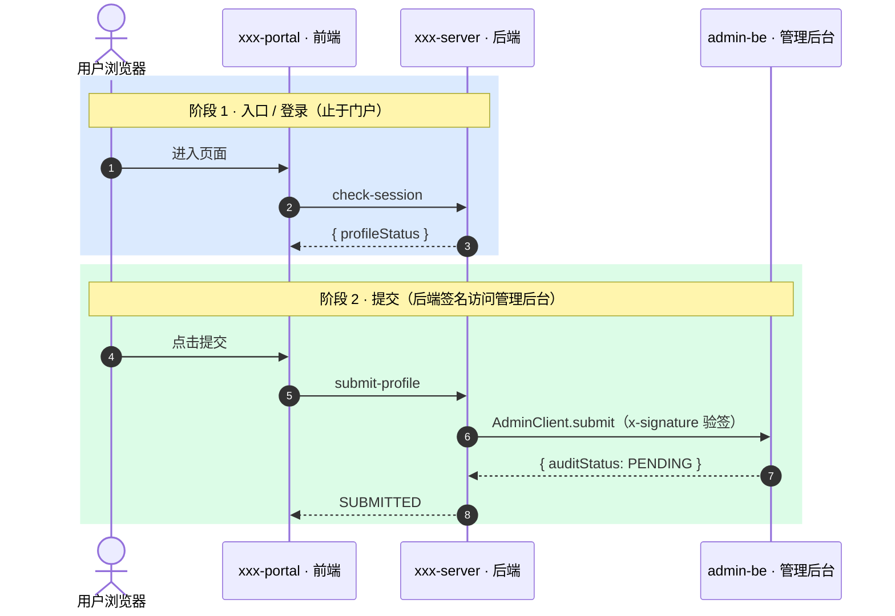
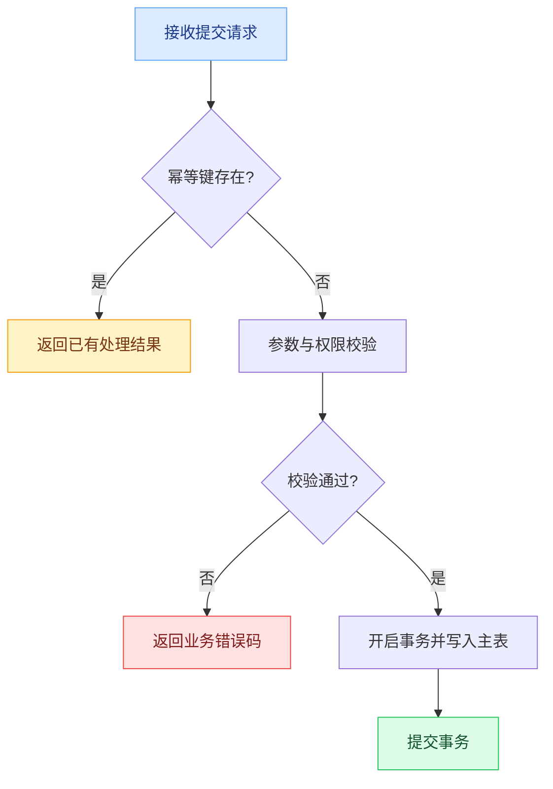

# api-tech 子命令

`api-tech` 生成后端技术方案文档。它不是仓库调研报告，不是项目入门说明，不是开发排期，也不生成后端代码骨架（不产出
controller / service / dto / entity 代码文件）。

## 代码事实优先

- 后端仓库可用时，接口、实体、schema 必须基于真实代码；写清具体文件路径与关键片段引用。
- 后端仓库不可用时，不写具体文件路径，不声称某资源存在，涉及具体接口 / 表的字段一律标记为待确认。
- 飞书 PRD / 需求与仓库代码冲突时，保留冲突并写入「风险与待确认项」，不擅自二选一。

## 工作流程

1. 收集上下文：PRD / 需求（优先用 `lark-read` 读取飞书文档）、可用的后端仓库代码。
2. 确认章节：必写章节自动纳入；可选章节逐项让用户勾选。
3. 用 `domains/backend/templates/api-tech.md` 作为骨架，只生成必写 + 选中可选章节。
4. 生成正式文档时删除模板中的 HTML 注释（含【必写】/【可选】标记）。
5. 生成后运行交付前自检。

## 选择式骨架

必写章节（总是生成）：

- 接口设计
- 数据模型 / 数据库设计
- 核心流程 / 时序
- 边界与异常
- 风险与待确认项

可选章节（由用户勾选，未选不生成、不写“不涉及”占位）：

- 背景与目标
- 范围与非目标
- 依赖与非功能性
- 完成标准

启动时先列出上述清单让用户确认要包含哪些可选章节，再生成。

## 标题与编号硬规则

- 分节一律用原生 Markdown 标题：章 `#`、节 `##`、小节 `###`，最多三级。
- **不写编号**：飞书「标题自动编号」是文档级 UI 显示开关、Open API 不可设置；也不要手写序号。需要编号时由用户在文档里开启。

## 排版与飞书呈现规范（定稿模板）

排版遵循 [shared/references/lark-doc.md](../../../shared/references/lark-doc.md) 的「排版与飞书呈现规范（定稿模板）」。以下为 `api-tech` 在通用规则之上追加的硬规则。

## 数据结构硬规则

实体 / 表用「字段表格 + TypeScript interface」双给：

- 字段表格列固定：字段、类型、必填、说明（默认 / 约束并入说明，保持 4 列、行矮）。
- 实体说明（collection、extends 等）写在表格上方的**引用块** `> …`。
- TypeScript interface：可空字段用 `?`，时间等注明单位（如 `// epoch ms`）。

## 接口呈现硬规则

接口设计章节每个接口条目按以下结构、label 全部加粗：

1. **用途**：用 bullet 列出能力点（多能力时），不写成一长段。
2. **入参**：4 列表格（参数、类型、必填、说明）**+** TypeScript DTO interface。
3. **出参**：TypeScript data interface（描述 `data` 结构），不贴 JSON 示例。
4. **说明**：用 bullet 列要点（副作用、事务、mock 口径等）。
5. **错误码**：内联文本，如 `` `40001` 参数校验失败 ｜ `40301` 登录态失效 ``；有业务码则补全。

## 章节规则

- 接口设计：先用引用块写统一约定（方法、Content-Type、返回体、鉴权、时间单位），再逐接口按上面的接口呈现硬规则写。
- 数据模型 / 数据库设计：每个实体 / 表给字段表格 + TS，并说明索引与 migration 影响；仓库可用时基于真实 entity /
  schema，不可用时标记为待确认。
- 核心流程 / 时序：业务流程超过 4 步或多服务调用时画 Mermaid（`sequenceDiagram` /
  `flowchart`），说明事务边界与幂等 / 并发。
- 边界与异常：覆盖空数据、失败、无权限、重复提交、并发冲突、部分数据缺失、回滚 / 重试 / 降级。
- 风险与待确认项：必写，收敛 PRD / 接口 / 仓库代码冲突，每条具体到可直接提问。

## Mermaid 风格规则

Mermaid 图必须提高技术评审效率，不做装饰。生成时优先保证语义清晰，其次保证层次和可读性。

### sequenceDiagram 调用链模板

接口调用链、多服务协作、前后端链路默认用 `sequenceDiagram`，并遵守：

- 开头使用 `autonumber`。
- 用户端用 `actor`，系统和服务用 `participant`。
- participant 别名使用业务可读名称，例如 `supplier-portal · 前端`、`supplier-server · 门户后端`。
- 按业务阶段使用 `rect rgb(...)` 分组，每个阶段用 `Note over` 写清阶段名和边界。
- 阶段颜色使用柔和浅色，推荐：
  - 蓝色 `rgb(219, 234, 254)`：入口 / 登录 / 初始化。
  - 黄色 `rgb(254, 243, 199)`：填写 / 暂存 / 草稿。
  - 绿色 `rgb(220, 252, 231)`：提交 / 成功 / 主链路完成。
  - 紫色 `rgb(243, 232, 255)`：审核 / 回流 / 异步状态。
  - 红色 `rgb(254, 226, 226)`：失败 / 驳回 / 异常分支。
- 每个阶段 4-8 条交互为宜；超过 8 条时拆阶段，不把所有细节堆进一块。
- 消息文案写业务动作和关键接口名，不写长 JSON。
- 必须表达信任边界、签名验签、事务边界、状态机、回调 / pull 模式等关键架构约束。

示例结构：



### flowchart 业务流程模板

事务分支、幂等、异常处理、状态判断默认用 `flowchart TD`，并遵守：

- 使用 `subgraph` 表达层次：入口、校验、核心处理、外部依赖、结果。
- 节点文本保持短句，复杂规则放正文，不塞进节点。
- 使用 `classDef` 区分类型：入口/成功/风险/外部依赖。
- 分支条件写在连线上，避免多个菱形连续堆叠。

示例结构：



### 图放在哪些章节

- `核心流程 / 时序`：至少保留一张 Mermaid 图。主链路优先 `sequenceDiagram`；存在复杂分支时补充 `flowchart TD`。
- `数据模型 / 数据库设计`：只有实体关系复杂时补充 `erDiagram`，不要替代表格 + TypeScript。
- `边界与异常`：异常路径多于 3 类时可补充异常流程 `flowchart TD`。
- `依赖与非功能性`：存在 MQ、缓存、第三方服务、回调 / pull 策略时可补充依赖链路图。

## 飞书上下文规则

如果用户提供飞书 PRD / 设计 / 接口链接，必须先用 `lark-read`
读取并结构化，再写方案；不得只凭链接标题或转述猜测。读取失败时停止依赖该文档的生成并说明原因。飞书内容与仓库代码冲突时写入风险与待确认项。

## 交付前自检

落地为 Markdown 文件后运行：

```bash
node .agent/skills/devFlow/domains/backend/scripts/check_api_tech_doc.mjs --file <markdown-file> --optional "<本次选中的可选章节，逗号分隔>"
```

自检覆盖：必写章节齐全、选中可选章节存在、数据模型含表格 + TS、接口设计含表格与 TS 代码块、核心流程含
Mermaid、风险与待确认项非空、标题为 `#`/`##`/`###` 且无手写序号。脚本输出 JSON，最终回复只摘必要状态。
