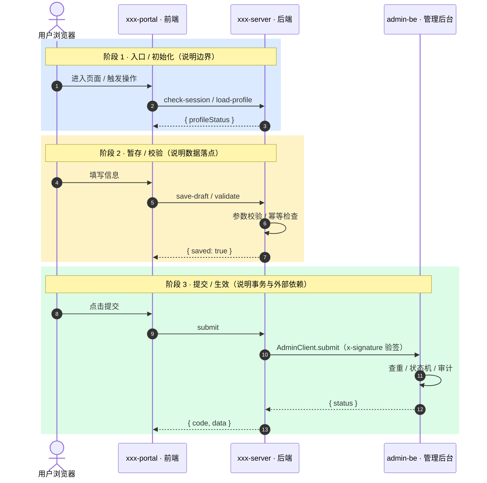
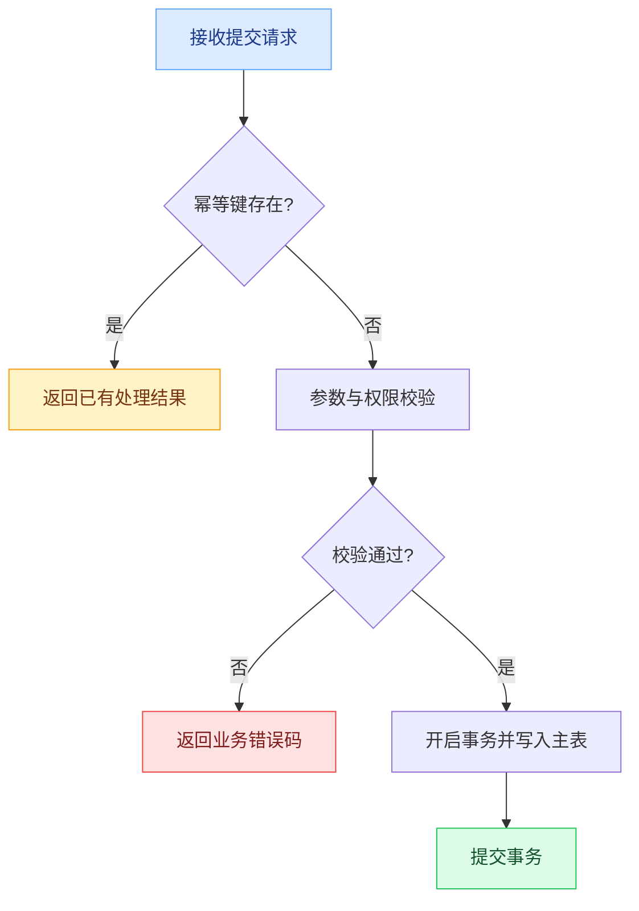

<!-- devFlow domains/backend api-tech 模板（定稿格式）。章节用 HTML 注释标【必写】/【可选】，生成正式文档时删除所有 HTML 注释。 -->
<!-- 飞书排版语法：> 引用块；> [!WARNING]/[!TIP]/[!NOTE] 高亮块；--- 分隔线；**x** 粗体；表格自动灰底表头+自适应列宽。标题不写编号。 -->

# 背景与目标
<!-- 【可选】 -->

说明本次后端要解决的问题与服务级目标。不写项目背景与技术栈罗列。

# 范围与非目标
<!-- 【可选】 -->

- 涉及的服务 / 模块。
- 明确不做的部分（非目标）。

# 接口设计
<!-- 【必写】 -->

> 统一约定：`POST`，`Content-Type: application/json`，返回体 `{ code, data }`，时间字段统一 epoch ms。鉴权：Admin 登录态。

## <模块名>

### <接口名> · POST /api/<module>/<action>

**用途**：用 bullet 列出能力点：

- 能力点 1
- 能力点 2

**入参**

| 参数 | 类型 | 必填 | 说明 |
| --- | --- | --- | --- |
| page | number | 是 | 页码（≥ 1） |
| pageSize | number | 是 | 每页条数（1–100） |

```typescript
interface ExampleDto {
  page: number
  pageSize: number
}
```

> [!WARNING] 标注本期为 mock / 跨模块依赖的字段，需在此提示。

**出参**（data 结构）

```typescript
interface ExampleData {
  total: number
  list: ExampleItem[]
}
```

**说明**

- 副作用 / 事务 / mock 口径等要点，逐条 bullet。

**错误码**：`40001` 参数校验失败 ｜ `40301` 登录态失效

---

# 数据模型 / 数据库设计
<!-- 【必写】 -->

## <实体 / 表名>

> 集合 <name>（用途）。extends Base: sys_status；timestamps。

| 字段 | 类型 | 必填 | 说明 |
| --- | --- | --- | --- |
| _id | ObjectId | 是 | 主键 |
| name | string | 是 | 名称，查重唯一 |
| createdAt | number | 是 | 创建时间，epoch ms |

```typescript
interface Entity {
  _id: string
  name: string
  createdAt: number // epoch ms
}
```

索引与 migration 影响：说明新增/变更的索引、唯一约束、迁移注意点。

# 核心流程 / 时序
<!-- 【必写】 -->

说明关键业务流程、调用链、事务边界与幂等 / 并发。状态流转用 Mermaid（源码）。生成正式文档时按实际场景保留必要图，不要机械保留所有示例。

**主链路时序图**



**关键分支流程图**（存在事务、幂等、异常分支时保留）



# 依赖与非功能性
<!-- 【可选】 -->

- 中间件 / 第三方 / MQ / 缓存。
- 限流、性能、安全与权限。

# 边界与异常
<!-- 【必写】 -->

- 空数据、请求失败、无权限、重复提交、并发冲突、部分数据缺失的处理与返回。
- 回滚、重试、降级策略。

# 完成标准
<!-- 【可选】 -->

说明后端做到什么程度算完成。保持简短，不写测试用例与排期。

# 风险与待确认项
<!-- 【必写】 -->

- 收敛 PRD / 接口 / 仓库代码冲突，每条具体到可直接问产品、前端或负责人。
