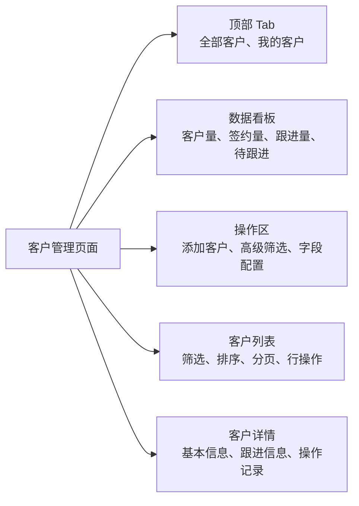
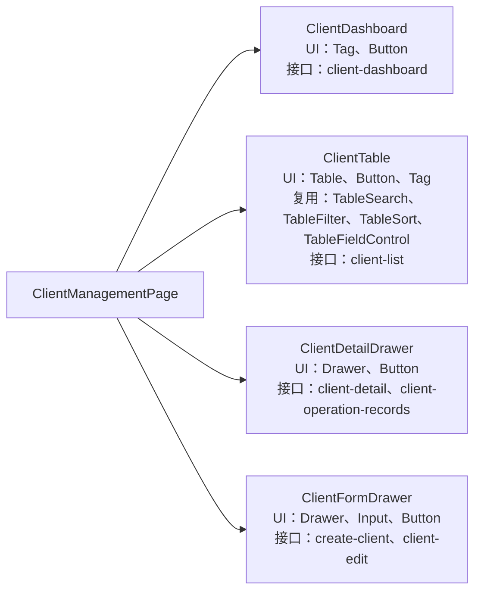

# page-tech 子命令

`page-tech`
用于产出页面级前端落地方案。它不是仓库调研报告、不是项目入门说明、不是开发计划，也不是完整文件改动清单。

执行 admin-fe 页面方案时，必须读取或内化项目根目录
`ADMIN_FE_WORKFLOW.md`。页面方案不得违反 admin-fe 的路由、请求、状态、Wujie、UI 复用和验证规则。

## 工作流程

1. 识别页面类型：列表页、详情页、表单页、配置页、工作台、弹窗/抽屉页面、混合页面。
2. 从用户请求、需求资料、设计稿、接口资料和当前仓库中收集上下文。
3. 判断每个章节的上下文是否足够。
4. 必需上下文缺失时，向用户确认，或写入“风险与待确认项”。
5. 只有在需要确认路径、可复用资源、UI 库用法、状态模式、接口封装、相似页面时，才读取仓库代码。
6. 使用 `assets/templates/page-tech.md` 作为文档骨架。
7. 页面不涉及的条件章节写“不涉及”，不要强行展开。
8. 判断哪些内容需要配图，先生成 Mermaid 源码；需要飞书落地时交给
   `design-lark-chart` 渲染。

如果用户要求最终发布到飞书，先生成完整 Markdown，再交给
`scripts/lark_publish_doc.mjs`。不要一边写方案一边拼飞书 blocks。

## 结构化表达规则

- 并列内容默认使用无序列表；只有存在明确顺序、流程或优先级时才使用有序列表。
- “功能列表”和“接口清单”不要重复。页面技术方案必须优先写成“功能与接口映射”表格，在同一行说明功能、PRD 交互项、接口、输入参数、响应数据、展示形式、状态变化、刷新行为和异常反馈。
- “功能与接口映射”不得用纯 bullet 替代表格，除非页面完全不依赖接口；如果确实不依赖接口，必须在该章节说明原因。
- “目录结构与产物路径”使用树形代码块，不使用表格。
- “可复用资源清单”优先使用树形代码块展示真实路径，再用短句补充用途。
- “组件拆分”优先用 `flowchart LR`
  图表达。节点内可以写 UI 资源、复用资源和接口资源，但不要把每个资源拆成独立节点。
- 节点文本控制在 3 行左右；资源较多时用顿号分隔，避免图过宽和分叉过多。

## PRD 交互覆盖规则

如果用户提供 PRD、设计说明、原型说明或飞书需求章节，必须先抽取页面交互清单，再写技术方案。交互清单至少覆盖以下项，PRD 中没有出现的项不要补造，写入“不涉及”或待确认：

- 页面入口、Tab、顶部操作、看板、列表、详情、表单、弹窗、抽屉、确认框。
- 按钮、行操作、批量操作、字段配置、高级筛选、排序、分页、上下翻页、预览、上传、删除。
- 表单字段、字段权限、默认值、只读、隐藏、必填、格式限制、数量限制、联动带出、清空规则。
- loading、空数据、失败、无权限、提交中、保存成功、删除成功、取消、中断恢复。
- 新增、编辑、删除、查询、筛选、排序、tab 切换后的接口调用、状态变化和刷新范围。

写作规则：

- `3.1 功能与接口映射` 必须把 PRD 交互项落到表格中，不能只写接口清单。
- `3.3 关键交互`
  必须逐项说明触发条件、前端行为、接口或状态影响、用户反馈、待确认项。
- `6. UI 与体验约束`
  必须覆盖 PRD 中出现的展示、校验、反馈、弹窗、上传、预览、空状态和错误提示。
- PRD 与接口文档、仓库代码或产品设计规范冲突时，不得自行取舍；冲突项必须进入
  `10. 风险与待确认项`。
- PRD 中的交互如果因接口缺失无法实现，必须在对应功能行和待确认项中同时标明，不得省略。

## 上下文规则

上下文分为三类：

- **必需上下文**：没有就不能可靠编写该章节，必须确认或标记为“待确认”。
- **条件上下文**：页面涉及对应能力时才写。
- **可选上下文**：存在且能提升方案质量时再写。

当前端仓库可用时，以下内容必须基于真实代码：

- 目录结构与预期产物路径
- 可复用项目公共组件
- 可复用业务组件
- hooks、utils、constants、services、stores/models 等资源
- 项目当前实际使用的 UI 库组件

admin-fe 必须遵守：

- 路由目录是 `src/routes/`。
- 禁止手动编辑 `src/routeTree.gen.ts`。
- API 调用统一使用 `src/services/request.ts`。
- 页面临时状态不使用 Zustand。
- shell 状态使用 `src/stores/shell-store.ts`。
- Wujie 逻辑复用 `src/shared/wujie-bridge.ts`。
- UI 复用顺序：Apex UI -> `src/common` -> 业务局部组件 -> 新建局部组件。

当前端仓库不可用时，不得写具体路径，也不得声称存在某个可复用资源。

## 飞书文档上下文规则

如果用户提供飞书云文档链接作为 PRD、设计说明、接口文档、字段规范或需求来源，必须先使用
`lark-read` 读取文档，再生成页面技术方案。

规则：

1. 先执行 `lark-read`，读取并结构化飞书文档内容。
2. 将 `lark-read` 输出作为 `page-tech` 的输入上下文。
3. 不得只根据链接标题、URL 或用户转述猜测文档内容。
4. 如果文档读取失败，必须停止依赖该文档的方案生成，并说明失败原因。
5. 如果飞书文档内容与仓库代码、接口说明或设计稿冲突，写入“风险与待确认项”。
6. 如果飞书文档内容不完整，只能基于已读取内容生成方案，其余部分写入待确认项。

推荐上下文注入顺序：

1. PRD 章节上下文：页面目标、页面结构、字段、交互、非目标范围。
2. 接口文档上下文：接口路径、入参、响应、错误、状态联动、副作用。
3. 用户补充约束：明确排除项、范围收窄、实现偏好。
4. 仓库证据：路由、service、request、UI 库、公共组件、相似页面。
5. 产品规范：只读取与当前字段和交互相关的分册。

写方案时必须区分“已确认事实”和“待确认项”，不要把用户明确排除的内容重新写入风险。

## 产品设计规范读取规则

当页面涉及字段、表单、筛选、列表展示、详情展示、上传、选择器、弹窗或操作反馈时，必须读取产品设计规范索引：

```text
references/product-design-specs/index.md
```

读取规则：

1. 先读 `index.md`，根据页面字段类型和交互能力判断要加载哪些规范分册。
2. 所有页面字段默认先读取 `field-common.md`。
3. 只读取当前页面相关的字段规范，不一次性加载全部规范。
4. 写页面技术方案时，只提炼当前页面需要遵守的规则，不整段复制规范正文。
5. 如果规范要求明确产品信息，例如小数位数、是否支持负数、数据来源、人员范围、上传格式、行数上限，且上下文缺失，必须写入“风险与待确认项”。
6. 如果字段类型无法判断，不要套用可能错误的规范，必须列为待确认。

常见路由：

- 文本、手机号、邮箱、身份证号、备注、富文本：读 `fields-text.md`。
- 金额、数量、比例、日期、时间：读 `fields-number-date.md`。
- 状态、类别、枚举、数据字典、级联选择：读 `fields-selectors.md`。
- 合同、项目、供应商、用户、部门等关联选择：读 `fields-relation.md`。
- 子表单、附件、图片上传：读 `fields-complex.md`。
- 默认值、空状态、操作反馈、弹窗、文案、中断恢复：读 `interaction.md`。

## 图表使用规则

页面技术方案中的图必须帮助审核者理解方案，不做装饰。优先生成 Mermaid 源码，并在需要飞书交付时调用
`design-lark-chart` 渲染。

### 必画场景

以下场景必须画图：

- 用户流程超过 4 个关键步骤：画用户流程图。
- 数据来自 2 个及以上接口，或存在接口依赖顺序：画数据流或接口时序图。
- 页面状态超过 4 类，或状态之间有明确转换：画状态流转图。
- 提交链路涉及前端校验、接口提交、结果刷新、错误回填：画提交时序图。
- 权限影响页面入口、按钮、字段展示或操作结果：画权限判断流程图。
- 页面包含看板、列表、详情、表单和删除等多接口联动时，`5.6 数据流`
  必须画页面数据流转图。

### 可选画图场景

以下场景有上下文且确实复杂时再画：

- 组件层级超过 5 个主要模块：画组件关系图。
- 异常处理分支较多：画异常处理流程图。
- 页面与上游/下游页面联动较多：画页面跳转流程图。
- 数据模型关系复杂：画 ER 图。

### 不画图场景

以下情况不要画图：

- 只有简单列表展示，流程少于 4 步。
- 图只能重复正文，没有增加理解价值。
- 上下文不足，图只能靠猜。
- 只是为了让文档看起来丰富。

### Mermaid 类型选择

- 用户流程：`flowchart`
- 页面入口与跳转：`flowchart`
- 页面结构：`flowchart LR`
- 数据流：`flowchart`
- 接口调用链路：`sequenceDiagram`
- 提交流程：`sequenceDiagram`
- 页面状态：`stateDiagram-v2`
- 权限判断：`flowchart`
- 组件关系：`flowchart LR`
- 数据实体关系：`erDiagram`
- 纯概念层级：可选 `mindmap`，但不作为页面结构或组件拆分默认图类型。

### 页面结构图规范

页面结构图默认使用
`flowchart LR`，将页面作为根节点，一级区域作为右侧节点。区域中的主要内容写在同一节点内，用顿号或
`<br/>` 分隔。

示例：



### 组件拆分图规范

组件拆分图默认使用
`flowchart LR`。组件节点中压缩标注 UI 资源、复用资源和接口资源，不拆成独立资源节点。

示例：



### 图放在哪些章节

- `2. 页面范围`：页面入口图、页面结构较复杂时的区域关系图。
- `3. 需求拆解`：用户流程图、关键交互流程图。
- `4. 数据与接口`：接口调用时序图、数据流图、实体关系图。
- `5. 前端实现方案`：组件关系图、页面数据流图。
- `7. 非功能性设计`：权限判断图、性能关键链路图、埋点链路图。
- `8. 边界场景`：复杂异常处理流程图。

### 飞书落地

- 文档中保留 Mermaid 源码，便于后续审核和修改。
- 如果用户要求同步到飞书、写到飞书文档、生成飞书画板，使用 `design-lark-chart`
  渲染 Mermaid 图。
- 渲染前检查 Mermaid 语法是否和图类型匹配。
- 图标题必须和正文场景对应，例如“用户查询流程图”“保存提交时序图”“页面状态流转图”。
- 普通飞书文档读写不需要初始化 `lark-cli`；只有 `design-lark-chart`
  或飞书画板链路明确要求时才初始化。

## 章节规则

### 1. 背景与目标

必需上下文：

- 页面名称
- 所属业务模块或功能域
- 需求描述、PRD、设计说明或用户给出的页面目标

写作规则：

- 只写这个页面要解决的问题和页面级目标。
- 不写项目背景，不写技术栈。
- 如果目标只能从设计稿推断，必须标注“根据设计稿推断，需确认”。

### 2. 页面范围

必需上下文：

- 页面入口或导航来源
- 设计稿或需求中的页面区域
- 页面状态
- 非目标范围或明确的需求边界

写作规则：

- “页面入口”写用户从哪里进入页面，不写路由实现。
- “页面结构”写用户可见区域，不写组件名称。
- “页面状态”至少考虑正常、loading、空数据、失败、无权限。
- “非目标范围”必须存在；如果用户未提供，可以提出建议边界，但必须标记为待确认。

### 3. 需求拆解

必需上下文：

- 功能需求
- 用户操作路径
- 交互规则
- 接口路径、入参、响应数据和展示形式，如果页面功能依赖接口。

写作规则：

- 功能列表只写页面内功能，并必须优先写成“功能与接口映射”表格。
- 如果功能依赖接口，在同一行内说明 PRD 交互项、接口、输入参数、响应数据、展示形式、状态变化、成功后的刷新范围和异常反馈。
- 建议表头为：功能、PRD 交互项、接口、入参、响应数据、页面展示 / 行为、状态变化、成功后刷新、异常反馈。
- 不再单独重复一份纯接口清单，除非用户明确要求接口评审表。
- 用户流程写用户动作链路。
- 关键交互写触发条件、系统行为和反馈结果。
- 关键交互必须覆盖 PRD 交互清单，不能只写通用查询、保存、删除。
- 不写开发步骤。
- 关键交互不明确时，列入待确认，不要补全规则。

### 4. 数据与接口

必需上下文：

- 页面展示字段、依赖数据或接口文档
- 已有 service 文件、mock 数据或后端约定

写作规则：

- 只有用户提供或代码中存在时，才写真实接口名称、路径、方法、参数和响应字段。
- 接口未确认时，可以写预期数据依赖，但接口细节必须标记为“待后端确认”。
- 不得凭空生成 TypeScript 请求类型或响应类型。
- 异常处理写页面表现，不写底层请求封装设计。
- 如果 `3.1 功能与接口映射`
  已完整覆盖接口，本章只补充公共数据依赖、参数约定、响应约定和异常口径，避免重复。

### 5. 前端实现方案

必需上下文：

- 可访问的前端仓库，用于确认路径和可复用资源
- 页面结构所需的设计或需求上下文
- 项目当前实际使用的 UI 库

写作规则：

- “目录结构与产物路径”只列页面级主要预期产物，不写完整文件改动清单。
- “目录结构与产物路径”使用树形代码块。
- “可复用资源清单”必须来自已有代码，可包含组件、hooks、utils、constants、services、stores/models、业务组件。
- “可复用资源清单”优先使用树形代码块展示路径。
- “UI 库组件清单”必须匹配项目当前实际使用的 UI 库。
- “组件拆分”基于页面区域和复用资源，不要过度拆分。
- “组件拆分”涉及多个区域时，优先提供 `flowchart LR`
  组件关系图，并在组件节点内压缩标注 UI 库资源、复用资源、接口资源。
- “状态设计”按需覆盖请求状态、页面状态、选中状态、表单状态、业务状态。
- “数据流”描述数据从入口参数、接口、用户操作到 UI 和提交的流转。
- 数据来自 2 个及以上接口，或存在创建 / 编辑 / 删除后刷新多个查询的联动时，“数据流”必须包含 Mermaid 数据流转图。
- 如果提交链路包含前端校验、接口提交、结果刷新和错误回填，必须在“数据流”或“提交表单与校验”中补充提交流程时序图。
- “提交表单与校验”是条件章节；纯展示页、列表页、只读详情页写“不涉及”。

### 6. UI 与体验约束

必需上下文：

- 设计稿来源或明确 UI 要求
- 终端范围，例如只支持桌面端或需要响应式

写作规则：

- 明确设计信息来源。
- 涉及异步数据的页面，必须写 loading、空状态和错误反馈。
- 没有响应式要求时，遵循项目既有适配方式，不新增断点假设。
- 不写笼统的视觉形容词。

### 7. 非功能性设计

必写：

- 性能设计
- 权限与安全
- 可维护性
- 可测试性

条件写：

- 可访问性：项目或页面有明确要求时写。
- 埋点与监控：存在埋点、日志、监控或分析上下文时写。

写作规则：

- 只写和当前页面相关的内容。
- 不得臆想性能指标、埋点事件名、监控面板或权限码。
- 性能设计重点关注分页、防重复请求、缓存、懒加载、大列表渲染、避免高成本重复渲染。
- 权限与安全重点关注页面访问权限、操作权限、敏感字段、危险操作确认和错误信息暴露。

### 8. 边界场景

必需上下文：

- 需求和数据行为
- 已知接口与权限行为

写作规则：

- 覆盖真实可能发生的页面边界：空数据、请求失败、无权限、重复提交、字段缺失、长文本、数据过期、部分数据缺失。
- 不写和页面无关的理论异常。

### 9. 完成标准

必需上下文：

- 页面目标
- 功能范围
- 设计和接口预期

写作规则：

- 保持简短。
- 说明页面做到什么程度算完成。
- 不写详细测试用例，不写 coding 排期。

### 10. 风险与待确认项

必写。

写作规则：

- 收敛前面所有不确定信息。
- 单独收敛 PRD / 接口 / 仓库代码 / 产品设计规范之间的冲突项。
- 每个问题都要具体到可以直接问产品、设计、后端或前端负责人。
- 如果没有不确定项，只有在确认全文没有臆想内容后，才写“暂无明确待确认项”。

## 交付前自检

生成页面技术方案后，必须执行一次人工自检；如果已经落地为 Markdown 文件，优先运行：

```bash
node .agent/skills/devFlow/scripts/check_page_tech_doc.mjs <markdown-file>
```

自检重点：

- `3.1 功能与接口映射`
  是否为表格，且包含 PRD 交互项、接口、入参、响应、展示、状态变化、刷新、异常反馈。
- PRD 中的交互项是否在 `3.3 关键交互` 或相关章节逐项覆盖。
- 多接口页面的 `5.6 数据流` 是否包含 Mermaid 数据流转图。
- 提交链路是否说明校验、提交、成功刷新和失败反馈。
- PRD、接口、仓库代码、规范冲突是否进入风险与待确认项。
