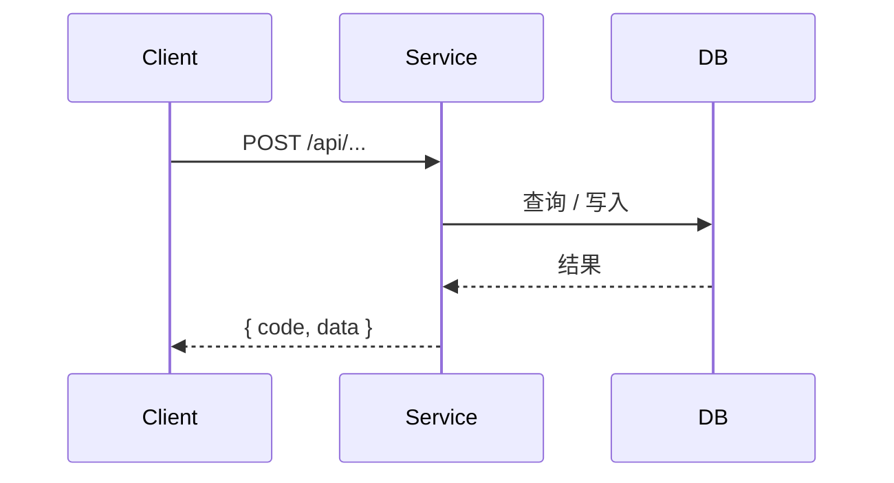

# backendFlow Skill Implementation Plan

> **For agentic workers:** REQUIRED SUB-SKILL: Use superpowers:subagent-driven-development (recommended) or superpowers:executing-plans to implement this plan task-by-task. Steps use checkbox (`- [ ]`) syntax for tracking.

**Goal:** 新增独立 skill `backendFlow`，生成可审核的后端技术方案文档，复用 devFlow 的飞书读写脚本。

**Architecture:** 与 `devFlow`/`figmaSync` 平级的子命令路由 skill。入口 `SKILL.md` 负责通用原则与路由；`references/` 放各子命令规则；`assets/templates/` 放文档骨架；`scripts/` 放唯一新增脚本（文档自检）。飞书读写不复制脚本，引用 `devFlow/scripts/` 的现有实现。

**Tech Stack:** Markdown skill 文件；Node.js（ESM `.mjs`，Node 内置 `node:test` 做单测，零三方依赖）。

## Global Constraints

- 所有 skill 文件用中文输出。
- 后端目标技术栈：Node.js（NestJS / Express）。
- 核心产出是**文档**，不生成 controller/service/dto/entity 代码骨架。
- 飞书读写复用 `devFlow/scripts/lark_read_docx.mjs` 与 `lark_publish_doc.mjs`，环境变量沿用 `FEISHU_APP_ID` / `FEISHU_APP_SECRET` / `FEISHU_WIKI_PARENT_NODE_TOKEN`；不在 skill 或仓库写密钥、不回显 secret。
- 标题硬规则：分节一律用原生 Markdown 标题 `#`/`##`/`###`（最多三级，对应飞书 heading1/2/3 自动编号）；标题文本**禁止手写序号**。
- 数据结构硬规则：实体/表 + 接口出入参用「字段表格 + TypeScript 代码块」双给。
- 接口要素硬规则：每个接口含①入参区分 path/query/body ②出参统一包裹 `{ code, data, message }` ③参数标注必填/默认/校验 ④错误码清单。
- 子命令运行时调用脚本，引用路径用仓库现有约定 `node .agent/skills/<skill>/scripts/<script>.mjs`。
- 设计依据：[spec](../specs/2026-06-30-backendflow-skill-design.md)。

---

### Task 1: 文档自检脚本 check_api_tech_doc.mjs

实现 backendFlow 唯一新增脚本：校验 api-tech 文档的章节齐全、数据结构/接口要素格式、标题格式。脚本导出纯函数 `checkApiTechDoc(markdown, { optional })`，配 `node:test` 单测；CLI 用 `--file` / `--optional`，输出 JSON + 退出码。脚本不依赖 devFlow 文件，零三方依赖。

**Files:**
- Create: `backendFlow/scripts/check_api_tech_doc.mjs`
- Test: `backendFlow/scripts/check_api_tech_doc.test.mjs`

**Interfaces:**
- Produces: `export function checkApiTechDoc(markdown: string, options?: { optional?: string[] }): { ok: boolean, issues: string[] }`。`optional` 是本次选中的可选章节中文名数组，取值范围 `['背景与目标','范围与非目标','依赖与非功能性','完成标准']`。
- CLI: `node check_api_tech_doc.mjs --file <md> [--optional "背景与目标,完成标准"]`，pass 时 stdout 打印 `{ok:true,issues:[]}` 退出 0，fail 时 stderr 打印 `{ok:false,issues:[...]}` 退出 1，缺 `--file` 退出 2。

- [ ] **Step 1: 写失败的单测**

Create `backendFlow/scripts/check_api_tech_doc.test.mjs`:

```javascript
import { test } from 'node:test'
import assert from 'node:assert/strict'

import { checkApiTechDoc } from './check_api_tech_doc.mjs'

const GOOD = `# 接口设计

## 列表查询
\`POST /api/x\`

| 位置 | 参数 | 类型 | 必填 | 默认 | 校验 | 说明 |
| --- | --- | --- | --- | --- | --- | --- |
| body | page | number | 否 | 1 | ≥1 | 页码 |

\`\`\`json
{ "code": 0, "data": {}, "message": "ok" }
\`\`\`

| code | 含义 | 触发条件 |
| --- | --- | --- |
| 0 | 成功 | — |

# 数据模型 / 数据库设计

| 字段 | 类型 | 必填 | 默认 / 约束 | 说明 |
| --- | --- | --- | --- | --- |
| id | string | 是 | — | 主键 |

\`\`\`typescript
interface E { id: string }
\`\`\`

# 核心流程 / 时序

\`\`\`mermaid
sequenceDiagram
  A->>B: x
\`\`\`

# 边界与异常

- 空数据返回空列表。

# 风险与待确认项

- 待确认 X 字段来源。
`

test('合规文档通过', () => {
  const r = checkApiTechDoc(GOOD)
  assert.equal(r.ok, true, JSON.stringify(r.issues))
})

test('缺必写章节报错', () => {
  const md = GOOD.replace('# 边界与异常', '# 其他')
  const r = checkApiTechDoc(md)
  assert.equal(r.ok, false)
  assert.ok(r.issues.some((i) => i.includes('边界与异常')))
})

test('标题手写序号报错', () => {
  const md = GOOD.replace('# 接口设计', '# 2. 接口设计')
  const r = checkApiTechDoc(md)
  assert.ok(r.issues.some((i) => i.includes('手写序号')))
})

test('数据模型缺 TS 报错', () => {
  const md = GOOD.replace(/```typescript[\s\S]*?```/, '')
  const r = checkApiTechDoc(md)
  assert.ok(r.issues.some((i) => i.includes('TypeScript')))
})

test('接口缺错误码报错', () => {
  const md = GOOD.replace('触发条件', '说明')
  const r = checkApiTechDoc(md)
  assert.ok(r.issues.some((i) => i.includes('错误码')))
})

test('已选可选章节缺失报错，未选的不报', () => {
  const missing = checkApiTechDoc(GOOD, { optional: ['完成标准'] })
  assert.ok(missing.issues.some((i) => i.includes('完成标准')))
  const none = checkApiTechDoc(GOOD)
  assert.equal(none.ok, true, JSON.stringify(none.issues))
})
```

- [ ] **Step 2: 运行单测确认失败**

Run: `node --test backendFlow/scripts/check_api_tech_doc.test.mjs`
Expected: FAIL — 报错无法解析模块 `check_api_tech_doc.mjs`（文件尚未创建）。

- [ ] **Step 3: 实现脚本**

Create `backendFlow/scripts/check_api_tech_doc.mjs`:

```javascript
import { readFileSync } from 'node:fs'

const REQUIRED_SECTIONS = [
  '接口设计',
  '数据模型 / 数据库设计',
  '核心流程 / 时序',
  '边界与异常',
  '风险与待确认项'
]

const OPTIONAL_SECTIONS = ['背景与目标', '范围与非目标', '依赖与非功能性', '完成标准']

function escapeRegExp(value) {
  return value.replace(/[.*+?^${}()|[\]\\]/g, '\\$&')
}

function hasSection(markdown, title) {
  return new RegExp(`^#{1,3}\\s+${escapeRegExp(title)}\\s*$`, 'm').test(markdown)
}

function getSection(markdown, title) {
  const pattern = new RegExp(`^(#{1,3})\\s+${escapeRegExp(title)}\\s*$`, 'm')
  const match = pattern.exec(markdown)
  if (!match) return ''

  const level = match[1].length
  const start = match.index + match[0].length
  const rest = markdown.slice(start)
  const lines = rest.split('\n')
  const collected = []

  // 收集到下一个同级或更高级标题为止，保留章节内的 ## / ### 子节内容。
  for (const line of lines) {
    const heading = /^(#{1,6})\s+/.exec(line)
    if (heading && heading[1].length <= level) break
    collected.push(line)
  }

  return collected.join('\n')
}

function hasTable(section) {
  return /\|.+\|\s*\n\|[\s:|-]+\|/.test(section)
}

function hasTsBlock(section) {
  return /```(typescript|ts)[\s\S]*?```/.test(section)
}

function hasMermaid(section) {
  return /```mermaid[\s\S]*?```/.test(section)
}

export function checkApiTechDoc(markdown, options = {}) {
  const optional = options.optional || []
  const issues = []

  for (const title of REQUIRED_SECTIONS) {
    if (!hasSection(markdown, title)) {
      issues.push(`缺少必写章节：${title}`)
    }
  }

  for (const title of optional) {
    if (!OPTIONAL_SECTIONS.includes(title)) {
      issues.push(`未知可选章节名：${title}`)
      continue
    }
    if (!hasSection(markdown, title)) {
      issues.push(`已选可选章节缺失：${title}`)
    }
  }

  const apiSection = getSection(markdown, '接口设计')
  if (apiSection) {
    if (!/\|\s*位置\s*\|/.test(apiSection)) {
      issues.push('接口设计缺少入参表「位置」列（需区分 path/query/body）')
    }
    if (!/"code"/.test(apiSection) || !/"data"/.test(apiSection)) {
      issues.push('接口设计出参未使用 { code, data, message } 统一包裹')
    }
    if (!/触发条件/.test(apiSection)) {
      issues.push('接口设计缺少错误码清单（含「触发条件」列）')
    }
  }

  const modelSection = getSection(markdown, '数据模型 / 数据库设计')
  if (modelSection) {
    if (!hasTable(modelSection)) {
      issues.push('数据模型缺少字段表格')
    }
    if (!hasTsBlock(modelSection)) {
      issues.push('数据模型缺少 TypeScript 代码块')
    }
  }

  const flowSection = getSection(markdown, '核心流程 / 时序')
  if (flowSection && !hasMermaid(flowSection)) {
    issues.push('核心流程 / 时序缺少 Mermaid 图')
  }

  const riskSection = getSection(markdown, '风险与待确认项')
  if (riskSection && riskSection.trim().length < 10) {
    issues.push('风险与待确认项为空')
  }

  const lines = markdown.split('\n')
  let inFence = false
  for (const line of lines) {
    if (/^```/.test(line)) {
      inFence = !inFence
      continue
    }
    if (inFence) continue

    const heading = /^(#{1,6})\s+(.+?)\s*$/.exec(line)
    if (!heading) continue

    if (heading[1].length > 3) {
      issues.push(`标题层级超过三级（飞书仅支持 H1-H3）：${line.trim()}`)
    }
    if (/^\s*\d+\s*[.、)]/.test(heading[2])) {
      issues.push(`标题不得手写序号：${heading[2]}`)
    }
  }

  return { ok: issues.length === 0, issues }
}

function parseFlags(argv) {
  const args = {}
  for (let index = 0; index < argv.length; index += 1) {
    const item = argv[index]
    if (!item.startsWith('--')) continue
    const key = item.slice(2)
    const next = argv[index + 1]
    if (!next || next.startsWith('--')) {
      args[key] = true
      continue
    }
    args[key] = next
    index += 1
  }
  return args
}

function main() {
  const args = parseFlags(process.argv.slice(2))
  if (!args.file || args.file === true) {
    console.error('Usage: node check_api_tech_doc.mjs --file <markdown> [--optional "背景与目标,完成标准"]')
    process.exit(2)
  }

  const optional =
    typeof args.optional === 'string'
      ? args.optional.split(',').map((value) => value.trim()).filter(Boolean)
      : []

  const markdown = readFileSync(args.file, 'utf8')
  const result = checkApiTechDoc(markdown, { optional })

  if (result.ok) {
    console.log(JSON.stringify(result, null, 2))
    process.exit(0)
  }

  console.error(JSON.stringify(result, null, 2))
  process.exit(1)
}

if (import.meta.url === `file://${process.argv[1]}`) {
  main()
}
```

- [ ] **Step 4: 运行单测确认通过**

Run: `node --test backendFlow/scripts/check_api_tech_doc.test.mjs`
Expected: PASS — 6 个用例全部通过（`tests 6` / `pass 6` / `fail 0`）。

- [ ] **Step 5: 提交**

```bash
git add backendFlow/scripts/check_api_tech_doc.mjs backendFlow/scripts/check_api_tech_doc.test.mjs
git commit -m "feat(backendFlow): add api-tech doc self-check script"
```

---

### Task 2: api-tech 文档模板

提供 api-tech 输出骨架。模板含全部章节（必写 + 全部可选），用 `#`/`##` 标题、无手写序号，用 HTML 注释标【必写】/【可选】。模板必须能通过 Task 1 的自检（带全部可选章节）。

**Files:**
- Create: `backendFlow/assets/templates/api-tech.md`

**Interfaces:**
- Consumes: Task 1 的 `check_api_tech_doc.mjs`（用于验证模板自身合规）。
- Produces: `assets/templates/api-tech.md`，被 `references/api-tech.md` 引用为骨架。

- [ ] **Step 1: 写模板文件**

Create `backendFlow/assets/templates/api-tech.md`:

````markdown
<!-- backendFlow api-tech 模板。章节用 HTML 注释标【必写】/【可选】。 -->
<!-- 标题禁止手写序号，飞书原生标题自动编号。生成正式文档时请删除本文件中的所有 HTML 注释。 -->

# 背景与目标
<!-- 【可选】 -->

说明本次后端要解决的问题与服务级目标。不写项目背景与技术栈罗列。

# 范围与非目标
<!-- 【可选】 -->

- 涉及的服务 / 模块。
- 明确不做的部分（非目标）。

# 接口设计
<!-- 【必写】 -->

统一约定：写明请求方法、`Content-Type`、统一返回体 `{ code, data, message }`、鉴权方式、时间字段单位等全局约定。

## <接口名称>

`POST /api/<module>/<action>` — 鉴权：<登录态 / 内部调用 / 开放>

入参（区分 path / query / body）：

| 位置 | 参数 | 类型 | 必填 | 默认 | 校验 | 说明 |
| --- | --- | --- | --- | --- | --- | --- |
| body | page | number | 否 | 1 | ≥ 1 | 页码 |
| body | keyword | string | 否 | — | ≤ 64 | 名称模糊搜索 |

出参（统一包裹 `{ code, data, message }`，`data` 结构见数据模型）：

```json
{
  "code": 0,
  "message": "ok",
  "data": { "total": 0, "list": [] }
}
```

错误码：

| code | 含义 | 触发条件 |
| --- | --- | --- |
| 0 | 成功 | — |
| 40001 | 参数校验失败 | 入参不满足校验规则 |
| 40301 | 登录态失效 | 无有效登录态 |

# 数据模型 / 数据库设计
<!-- 【必写】 -->

## <实体 / 表名>

| 字段 | 类型 | 必填 | 默认 / 约束 | 说明 |
| --- | --- | --- | --- | --- |
| id | string | 是 | 主键 | 唯一 ID |
| name | string | 是 | 长度 1–64 | 名称 |
| status | enum | 是 | ACTIVE / FROZEN | 状态 |
| createdAt | number | 是 | epoch ms | 创建时间 |

```typescript
interface Entity {
  id: string
  name: string
  status: 'ACTIVE' | 'FROZEN'
  createdAt: number // epoch ms
}
```

索引与 migration 影响：说明新增/变更的索引、唯一约束、迁移注意点。

# 核心流程 / 时序
<!-- 【必写】 -->

说明关键业务流程、调用链、事务边界与幂等 / 并发处理。



# 依赖与非功能性
<!-- 【可选】 -->

- 中间件 / 第三方 / MQ / 缓存。
- 限流、性能、安全与权限。

# 边界与异常
<!-- 【必写】 -->

- 空数据、请求失败、无权限、重复提交、并发冲突、部分数据缺失等的处理与返回。
- 回滚、重试、降级策略。

# 完成标准
<!-- 【可选】 -->

说明后端做到什么程度算完成。保持简短，不写测试用例与排期。

# 风险与待确认项
<!-- 【必写】 -->

- 收敛 PRD / 接口 / 仓库代码冲突，每条具体到可直接问产品、前端或负责人。
````

- [ ] **Step 2: 验证模板通过自检（带全部可选章节）**

Run:
```bash
node backendFlow/scripts/check_api_tech_doc.mjs --file backendFlow/assets/templates/api-tech.md --optional "背景与目标,范围与非目标,依赖与非功能性,完成标准"
```
Expected: stdout 打印 `{ "ok": true, "issues": [] }`，退出码 0。

- [ ] **Step 3: 验证模板能转换为飞书 blocks（标题映射正确）**

Run:
```bash
node devFlow/scripts/markdown_to_lark_blocks.mjs --file backendFlow/assets/templates/api-tech.md | node -e "const d=JSON.parse(require('fs').readFileSync(0,'utf8'));const h=d.blocks.filter(b=>[3,4,5].includes(b.block_type));console.log('heading blocks:',h.length);process.exit(h.length>=9?0:1)"
```
Expected: 打印 `heading blocks: N`（N ≥ 9，对应 9 个章节标题映射为 heading1/2/3 原生块），退出码 0。

- [ ] **Step 4: 提交**

```bash
git add backendFlow/assets/templates/api-tech.md
git commit -m "feat(backendFlow): add api-tech document template"
```

---

### Task 3: SKILL.md 入口

写 backendFlow 入口：通用原则、格式硬规则、子命令路由表。风格对齐 `devFlow/SKILL.md`。

**Files:**
- Create: `backendFlow/SKILL.md`

**Interfaces:**
- Consumes: `references/*.md`、`assets/templates/api-tech.md`、`scripts/check_api_tech_doc.mjs`、devFlow 飞书脚本。
- Produces: skill 入口，frontmatter `name: backendFlow` + `description`。

- [ ] **Step 1: 写 SKILL.md**

Create `backendFlow/SKILL.md`:

````markdown
---
name: backendFlow
description:
  后端研发工作流入口。按子命令读取上下文、生成可审核的后端技术方案文档并发布到飞书。适用于用户要求写后端技术方案、接口设计、数据模型/数据库设计、核心流程时序等后端落地文档时。当前支持 api-tech 子命令生成后端技术方案，支持 lark-read 读取飞书 PRD 作为上下文，支持 lark-doc 发布到飞书 Wiki，支持 prepare 说明飞书环境变量；飞书读写复用 devFlow 脚本。核心产出是文档，不生成后端代码骨架。
---

# 后端研发工作流

本 Skill 是后端研发工作流入口，与前端 `devFlow` 平级。它识别任务类型、选择子命令、加载对应规则和模板。子命令详细规则放入 `references/`，不堆在本文件。

## 通用原则

- 使用中文输出。
- 文档的主要构建者和审核者是人，AI 只生成结构化、可审核、可修改的初稿。
- 必须基于用户提供的需求、设计、接口、仓库代码写作。
- 不得臆想接口字段、表字段、路径、错误码、权限码、状态或 coding 细节。
- 必需上下文缺失时，向用户确认，或写入“风险与待确认项”。
- 核心产出是后端技术方案文档，不生成 controller / service / dto / entity 代码骨架。
- 代码事实优先：后端仓库可用时，接口、实体、schema 必须基于真实代码；仓库不可用时不写具体路径、不声称某资源存在。
- 飞书读写、Markdown 转 Docx blocks、权限检查复用 `devFlow/scripts/` 脚本，不重复造脚本，环境变量沿用同一套 `FEISHU_*`。
- 读写飞书直接使用飞书 Open API 和环境变量，不需要初始化 `lark-cli`。

## 格式硬规则

- 分节一律用原生 Markdown 标题层级：章 `#`、节 `##`、小节 `###`，最多三级，对应飞书 heading1/2/3 自动编号。
- 标题文本禁止手写序号（写 `## 接口设计`，不写 `## 2. 接口设计`）；序号交给飞书标题自动编号。
- 数据结构（实体/表 + 接口出入参）用「字段表格 + TypeScript 代码块」双给；复杂嵌套可补 JSON 示例。
- 每个接口必含四要素：入参区分 path/query/body、出参统一包裹 `{ code, data, message }`、参数标注必填/默认/校验、错误码清单。
- 生成文档后用 `scripts/check_api_tech_doc.mjs` 自检。

## 图表工作流

技术文档需要图时，用 Mermaid 作为源码：接口时序 `sequenceDiagram`、业务流程 `flowchart`、数据实体 `erDiagram`、状态流转 `stateDiagram-v2`。正文保留 Mermaid 源码；要落地飞书画板时交 `design-lark-chart` 渲染。

## 子命令路由

### prepare

用途：说明 backendFlow 使用飞书读写前需要配置的环境变量。

触发方式：用户输入 `backendFlow prepare`、要求“初始化 backendFlow”、“配置飞书环境变量”，或第一次使用 `lark-read` / `lark-doc` 前。

执行规则：读取 `references/prepare.md`，告知必需变量与发布 Wiki 所需变量，不回显 secret。

### api-tech

用途：生成后端技术方案文档（接口设计、数据模型、核心流程时序、边界与异常、风险）。

触发方式：用户输入 `backendFlow api-tech`、要求“写后端技术方案”“写接口设计文档”“根据 PRD 生成后端落地方案”。

执行规则：读取 `references/api-tech.md`，按选择式骨架确认章节，使用 `assets/templates/api-tech.md` 作为骨架，生成后用 `scripts/check_api_tech_doc.mjs` 自检。

### lark-read

用途：读取飞书 PRD / 需求文档作为上下文。

触发方式：用户输入 `backendFlow lark-read`、提供飞书文档链接并要求读取、要求“根据这个飞书文档写后端方案”。

执行规则：读取 `references/lark-read.md`，调用 `devFlow/scripts/lark_read_docx.mjs` 读取并结构化内容。

### lark-doc

用途：把后端技术方案发布到飞书 Wiki 父节点。

触发方式：用户输入 `backendFlow lark-doc`、要求“发布到飞书”“写入飞书文档”。

执行规则：读取 `references/lark-doc.md`，调用 `devFlow/scripts/lark_publish_doc.mjs` 发布 Markdown 正文，返回飞书链接。

## 未实现子命令

当前仅实现 `prepare`、`api-tech`、`lark-read`、`lark-doc`。用户要求其他后端文档类型（重构方案、接口评审表等）时，先说明尚未定义对应子命令，再与用户确认是否扩展，不临时发挥。
````

- [ ] **Step 2: 验证 frontmatter 与四个子命令齐全**

Run:
```bash
grep -c "^name: backendFlow" backendFlow/SKILL.md && grep -E "^### (prepare|api-tech|lark-read|lark-doc)$" backendFlow/SKILL.md
```
Expected: 先打印 `1`，再列出四行子命令标题 `### prepare` / `### api-tech` / `### lark-read` / `### lark-doc`。

- [ ] **Step 3: 提交**

```bash
git add backendFlow/SKILL.md
git commit -m "feat(backendFlow): add skill entry with subcommand routing"
```

---

### Task 4: api-tech 子命令规则

写 api-tech 的详细执行规则：选择式骨架机制、章节规则、格式硬规则、Mermaid 与飞书落地、交付前自检。

**Files:**
- Create: `backendFlow/references/api-tech.md`

**Interfaces:**
- Consumes: `assets/templates/api-tech.md`、`scripts/check_api_tech_doc.mjs`。
- Produces: `references/api-tech.md`，被 SKILL.md 的 api-tech 路由读取。

- [ ] **Step 1: 写 references/api-tech.md**

Create `backendFlow/references/api-tech.md`:

````markdown
# api-tech 子命令

`api-tech` 生成后端技术方案文档。它不是仓库调研报告，不是项目入门说明，不是开发排期，也不生成后端代码骨架。

## 工作流程

1. 收集上下文：PRD / 需求（优先用 `lark-read` 读取飞书文档）、可用的后端仓库代码。
2. 确认章节：必写章节自动纳入；可选章节逐项让用户勾选。
3. 用 `assets/templates/api-tech.md` 作为骨架，只生成必写 + 选中可选章节。
4. 生成正式文档时删除模板中的 HTML 注释（含【必写】/【可选】标记）。
5. 生成后运行交付前自检。

## 选择式骨架

必写章节（总是生成）：

- 接口设计
- 数据模型 / 数据库设计
- 核心流程 / 时序
- 边界与异常
- 风险与待确认项

可选章节（由用户勾选，未选不生成、不写“不涉及”占位）：

- 背景与目标
- 范围与非目标
- 依赖与非功能性
- 完成标准

启动时先列出上述清单让用户确认要包含哪些可选章节，再生成。

## 标题与编号硬规则

- 分节一律用原生 Markdown 标题：章 `#`、节 `##`、小节 `###`，最多三级。
- 标题文本禁止手写序号；蓝色序号由飞书原生标题自动编号生成。
- 可选章节被跳过不影响编号，飞书按实际存在的标题重新自动编号。

## 数据结构硬规则

实体 / 表、接口出入参的数据结构用「字段表格 + TypeScript 代码块」双给：

- 字段表格列固定：字段、类型、必填、默认 / 约束、说明。
- TypeScript interface / DTO：可空字段用 `?`，时间等注明单位（如 `// epoch ms`）。
- 复杂嵌套可补 JSON 示例，但不替代表格。

## 接口要素硬规则

接口设计章节每个接口条目必含四要素：

1. 入参区分 path / query / body：入参表列固定为位置、参数、类型、必填、默认、校验、说明，位置取值 `path` / `query` / `body`。
2. 出参统一包裹：响应用 `{ code, data, message }`，`data` 再展开业务字段，结构遵循数据结构硬规则。
3. 参数标注必填 / 默认 / 校验：体现在入参表三列，校验写长度 / 范围 / 枚举等。
4. 错误码清单：列为 code、含义、触发条件。有业务错误码必写；纯 CRUD 至少列通用码（成功、参数校验失败、登录态失效）。

## 章节规则

- 接口设计：先写统一约定（方法、Content-Type、返回体、鉴权、时间单位），再逐接口写四要素。
- 数据模型 / 数据库设计：每个实体 / 表给字段表格 + TS，并说明索引与 migration 影响；仓库可用时基于真实 entity / schema，不可用时标记为待确认。
- 核心流程 / 时序：业务流程超过 4 步或多服务调用时画 Mermaid（`sequenceDiagram` / `flowchart`），说明事务边界与幂等 / 并发。
- 边界与异常：覆盖空数据、失败、无权限、重复提交、并发冲突、部分数据缺失、回滚 / 重试 / 降级。
- 风险与待确认项：必写，收敛 PRD / 接口 / 仓库代码冲突，每条具体到可直接提问。

## 飞书上下文规则

如果用户提供飞书 PRD / 设计 / 接口链接，必须先用 `lark-read` 读取并结构化，再写方案；不得只凭链接标题或转述猜测。读取失败时停止依赖该文档的生成并说明原因。飞书内容与仓库代码冲突时写入风险与待确认项。

## 交付前自检

落地为 Markdown 文件后运行：

```bash
node .agent/skills/backendFlow/scripts/check_api_tech_doc.mjs --file <markdown-file> --optional "<本次选中的可选章节，逗号分隔>"
```

自检覆盖：必写章节齐全、选中可选章节存在、数据模型含表格 + TS、接口含 path/query/body 入参表与 code/data 出参与错误码表、核心流程含 Mermaid、风险与待确认项非空、标题为 `#`/`##`/`###` 且无手写序号。脚本输出 JSON，最终回复只摘必要状态。
````

- [ ] **Step 2: 验证关键规则齐全**

Run:
```bash
grep -E "选择式骨架|path / query / body|字段表格 \+ TypeScript|check_api_tech_doc.mjs" backendFlow/references/api-tech.md
```
Expected: 四个关键短语各命中至少一行。

- [ ] **Step 3: 提交**

```bash
git add backendFlow/references/api-tech.md
git commit -m "feat(backendFlow): add api-tech subcommand rules"
```

---

### Task 5: prepare / lark-read / lark-doc 子命令规则

写三个飞书相关的子命令规则。均复用 devFlow 脚本与环境变量，不复制脚本。

**Files:**
- Create: `backendFlow/references/prepare.md`
- Create: `backendFlow/references/lark-read.md`
- Create: `backendFlow/references/lark-doc.md`

**Interfaces:**
- Consumes: `devFlow/scripts/lark_read_docx.mjs`、`devFlow/scripts/lark_publish_doc.mjs`、`devFlow/scripts/lark_check_permissions.mjs`。
- Produces: 三个 references，被 SKILL.md 对应路由读取。

- [ ] **Step 1: 写 references/prepare.md**

Create `backendFlow/references/prepare.md`:

````markdown
# prepare 子命令

`prepare` 说明 backendFlow 使用飞书读写前需要配置的环境变量。只给准备清单，不读写飞书。环境变量与 devFlow 共用同一套。

## 必需环境变量

读取和发布都必须配置：

```text
FEISHU_APP_ID
FEISHU_APP_SECRET
```

规则：

- 不要把 `FEISHU_APP_SECRET` 写入 skill、仓库文件、方案正文或日志，也不在回复中回显。
- 缺任一变量时 `lark-read` / `lark-doc` 不能执行。
- 普通飞书文档读写直接用飞书 Open API，不需要初始化 `lark-cli`。

## 发布 Wiki 所需变量

发布到飞书 Wiki 父节点时还需：

```text
FEISHU_WIKI_PARENT_NODE_TOKEN
```

只读取文档时不需要该变量；发布时除非用户本次提供其他 Wiki 父节点链接。

## 可选权限检查

复用 devFlow 的权限检查脚本：

```bash
node .agent/skills/devFlow/scripts/lark_check_permissions.mjs --url "飞书链接"
```

## 输出要求

回复用户：读取与发布分别需要哪些变量、哪些必需哪些仅发布时需要、如何配置（不写入仓库）、普通读写不需 `lark-cli`、后续读写前先确认应用权限与文档授权。
````

- [ ] **Step 2: 写 references/lark-read.md**

Create `backendFlow/references/lark-read.md`:

````markdown
# lark-read 子命令

`lark-read` 读取飞书云文档 / Wiki，提取内容作为后端方案上下文。复用 devFlow 脚本，不复制实现。

## 执行规则

1. 默认使用 devFlow 脚本读取：

   ```bash
   node .agent/skills/devFlow/scripts/lark_read_docx.mjs --url "飞书链接"
   ```

2. 用环境变量读取飞书配置，不在 skill 或仓库写密钥。
3. 判断链接类型：Wiki 节点、Docx 文档、旧版 Docs。
4. 读取内容并整理成结构化上下文。
5. 供 `api-tech` 使用时，至少输出：服务 / 模块目标、接口需求、字段 / 数据结构、业务流程、错误与边界、待确认项。
6. 读取失败时停止依赖该文档的方案生成，并说明失败原因。
````

- [ ] **Step 3: 写 references/lark-doc.md**

Create `backendFlow/references/lark-doc.md`:

````markdown
# lark-doc 子命令

`lark-doc` 把后端技术方案发布到飞书 Wiki 父节点下。复用 devFlow 脚本，不复制实现。

## 执行规则

1. 先生成完整 Markdown 正文，再发布；不要边写方案边拼飞书 blocks。
2. 默认使用 devFlow 脚本发布：

   ```bash
   node .agent/skills/devFlow/scripts/lark_publish_doc.mjs --file <markdown-file> --title "<文档标题>"
   ```

3. 用环境变量读取飞书配置，不在 skill 或仓库写密钥。
4. 默认使用 `FEISHU_WIKI_PARENT_NODE_TOKEN` 作为父节点，除非用户本次提供其他 Wiki 父节点链接。
5. 分节用原生标题层级，由飞书标题自动编号，不手写序号。
6. 创建 Wiki 子文档并写入正文后，返回飞书文档链接。

## 标题自动编号说明

飞书标题序号依赖文档的“标题自动序号”显示能力。若发布后未显示蓝色序号，提示用户在文档设置中开启，不通过手写序号绕过。
````

- [ ] **Step 4: 验证三个 references 都引用 devFlow 脚本**

Run:
```bash
grep -l "devFlow/scripts/" backendFlow/references/prepare.md backendFlow/references/lark-read.md backendFlow/references/lark-doc.md
```
Expected: 三个文件路径全部列出（各自含对 devFlow 脚本的引用）。

- [ ] **Step 5: 提交**

```bash
git add backendFlow/references/prepare.md backendFlow/references/lark-read.md backendFlow/references/lark-doc.md
git commit -m "feat(backendFlow): add prepare/lark-read/lark-doc subcommand rules"
```

---

### Task 6: README 更新与集成验证

在 README 补充 backendFlow 简述，并做整体集成验证：单测、模板自检、模板转飞书 blocks。

**Files:**
- Modify: `README.md`

**Interfaces:**
- Consumes: 前 5 个 task 的全部产物。

- [ ] **Step 1: 改写 README.md**

Replace `README.md` content with:

```markdown
# dev-workflow-skill

研发工作流 Skill 集合：

- `devFlow` — 前端（admin-fe）研发文档与基建工作流，含飞书读写脚本。
- `backendFlow` — 后端研发技术方案文档工作流，复用 devFlow 飞书脚本。
- `figmaSync` — Figma 设计稿 → 原生 CSS 落地工作流。

各 skill 入口见对应目录下的 `SKILL.md`。
```

- [ ] **Step 2: 全量单测**

Run: `node --test backendFlow/scripts/check_api_tech_doc.test.mjs`
Expected: PASS（`pass 6` / `fail 0`）。

- [ ] **Step 3: 模板自检（全可选章节）**

Run:
```bash
node backendFlow/scripts/check_api_tech_doc.mjs --file backendFlow/assets/templates/api-tech.md --optional "背景与目标,范围与非目标,依赖与非功能性,完成标准"
```
Expected: `{ "ok": true, "issues": [] }`，退出码 0。

- [ ] **Step 4: 模板转飞书 blocks 不报错**

Run: `node devFlow/scripts/markdown_to_lark_blocks.mjs --file backendFlow/assets/templates/api-tech.md > /dev/null && echo OK`
Expected: 打印 `OK`（转换无异常）。

- [ ] **Step 5: 确认目录结构齐全**

Run: `find backendFlow -type f | sort`
Expected: 列出 `SKILL.md`、`references/{prepare,api-tech,lark-read,lark-doc}.md`、`assets/templates/api-tech.md`、`scripts/check_api_tech_doc.mjs`、`scripts/check_api_tech_doc.test.mjs`。

- [ ] **Step 6: 提交**

```bash
git add README.md
git commit -m "docs: list backendFlow skill in README"
```

---

## 实现完成后

全部 task 完成后，`backendFlow` 应：

- 目录结构齐全（SKILL.md + 4 references + 模板 + 自检脚本 + 单测）。
- `check_api_tech_doc.mjs` 单测全过，模板自身通过自检。
- 模板能转为飞书原生标题块。
- README 并列列出三个 skill。
