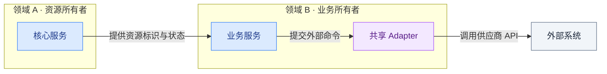
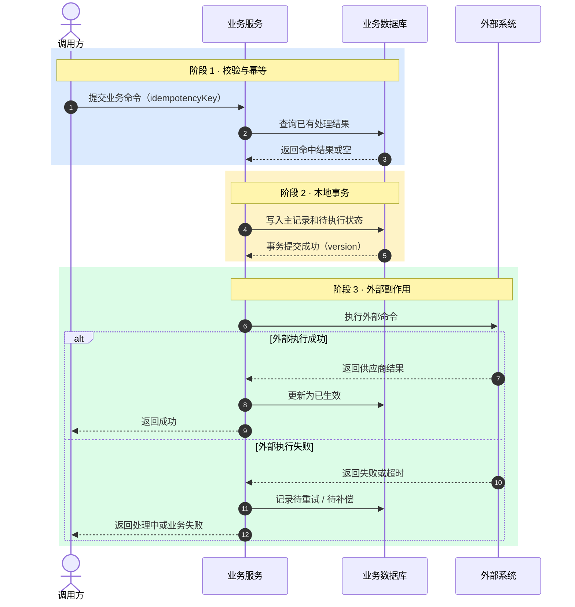
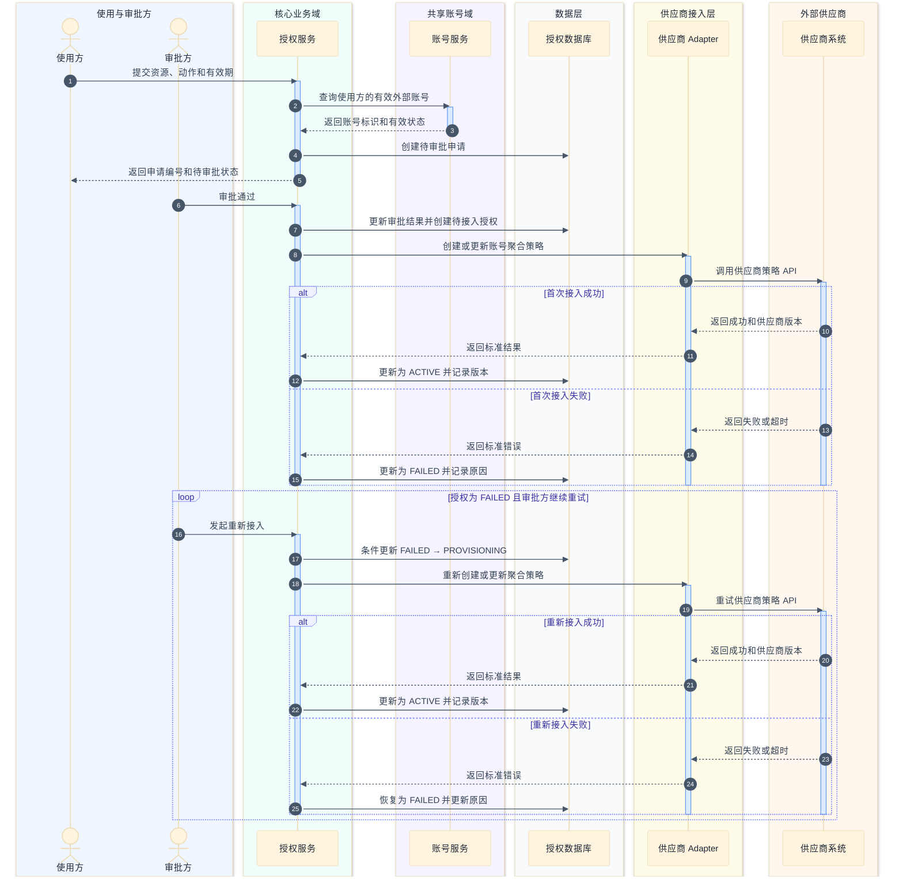
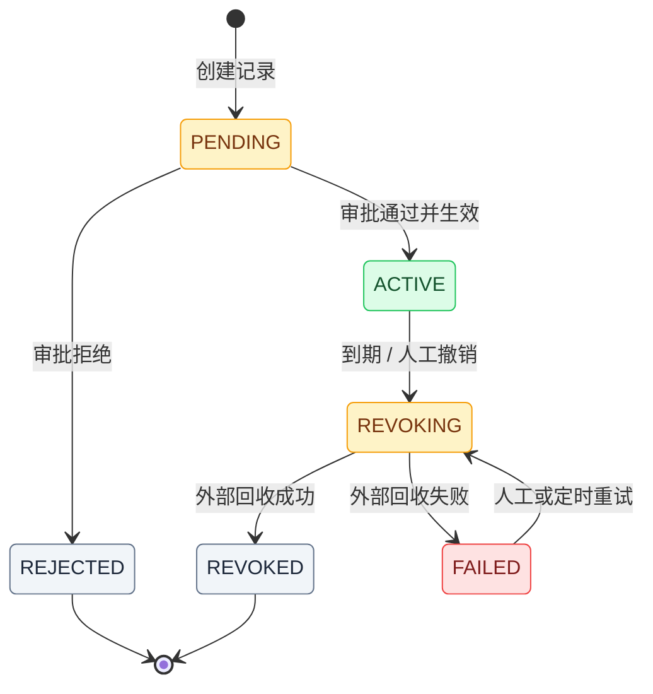
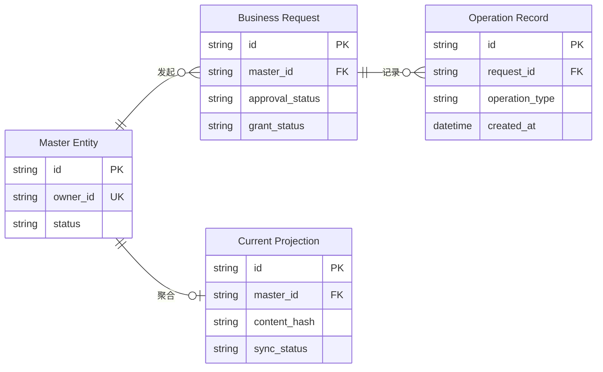
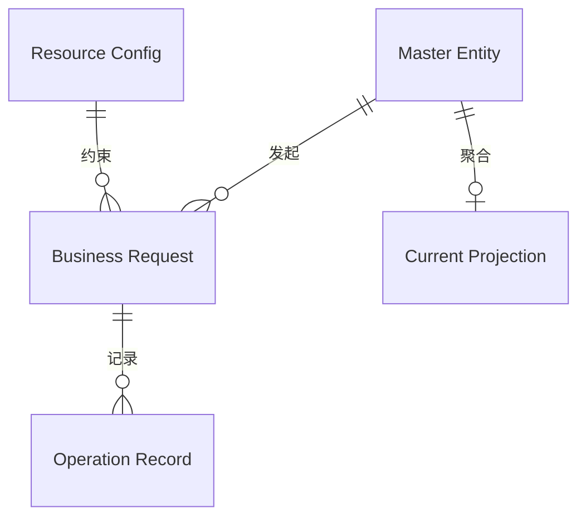
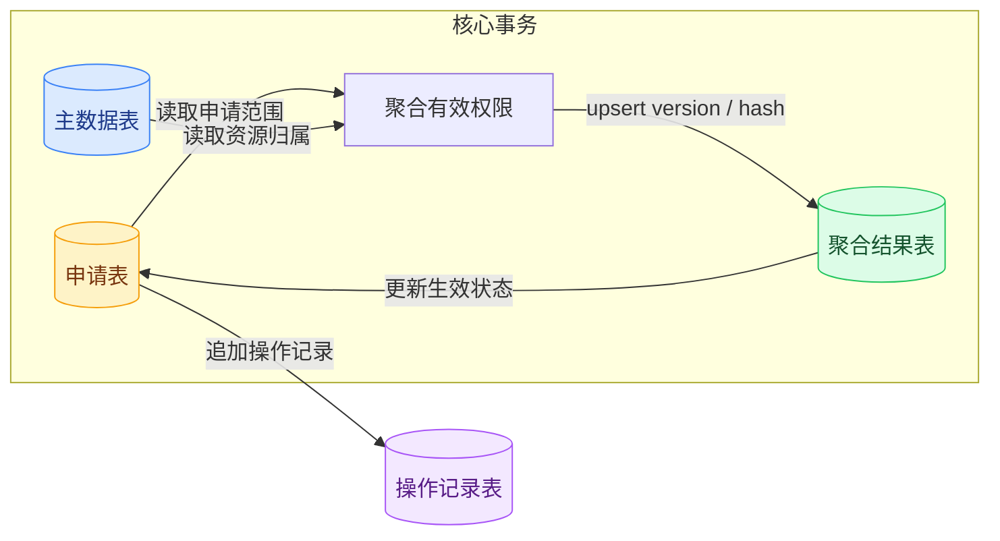
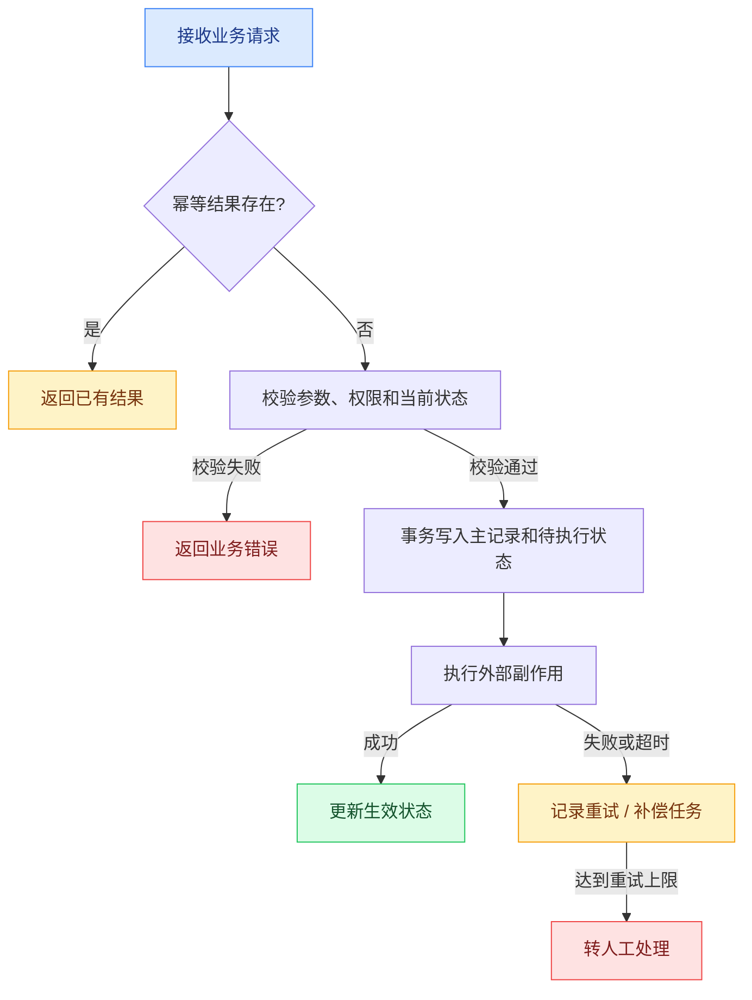

# 后端技术方案 Mermaid 规范

Mermaid 图用于降低技术评审的理解成本，不用于装饰文档。方案命中选图条件时，在「核心流程 / 时序」中至少保留一张主图；主图类型根据核心技术问题选择，不固定为时序图。其他图只有在回答新的独立评审问题时才增加。

## 选图流程

生成图前先回答：评审人最需要通过这张图确认什么？只选择能直接回答该问题的图型。

| 评审问题 | 推荐图型 | 典型触发条件 |
| --- | --- | --- |
| 模块分别负责什么、依赖方向是什么 | `flowchart LR` 模块边界图 | 新增模块、职责迁移、三个及以上模块协作 |
| 请求如何跨服务或外部系统执行 | `sequenceDiagram` | 多服务调用、回调、异步任务、外部副作用 |
| 状态如何合法流转 | `stateDiagram-v2` | 三个及以上状态、存在驳回/失效/恢复等分支 |
| 表之间是什么静态关系 | `erDiagram` | 两张以上表且基数、主外键或归属关系需要评审 |
| 一次业务操作如何读写、聚合和补偿多张表 | `flowchart LR` / `flowchart TD` 表数据流转图 | 跨表事务、派生数据、审计记录、补偿或回收任务 |
| 条件、幂等、重试和异常如何分支 | `flowchart TD` 业务流程图 | 三类以上分支或存在并发、重试、降级 |

命中任一触发条件时，先生成一张回答最重要评审问题的主图。复杂方案通常控制在 1–3 张，超过时逐图判断是否能合并或删除，但不设置绝对数量上限。

所有触发条件都不满足时，不为通过模板检查而生成图；在「核心流程 / 时序」中写一条非空的 **无需配图原因**，具体说明为何文字和表格已足以完成评审。「有 Mermaid 图」与「无需配图原因」只能二选一。

## 每张图的交付契约

每张 Mermaid 图都必须按以下结构呈现：

1. **图示目标**：一句话说明该图要回答的评审问题。
2. Mermaid 源码：只表达与目标直接相关的节点、关系和分支。
3. **关键结论 / 不变量**：用 bullet 固化事务边界、所有权、状态约束、一致性或补偿规则。

不同图不得重复回答同一个问题。正常路径、异常路径和补偿路径能够在同一张图中清楚表达时，优先使用 `alt`、`opt`、阶段分组或条件分支，不拆成多张近似图。

## 通用可读性规则

- 单图建议不超过 10 个主要节点、15 条主要连线；超出时按领域、事务或业务阶段拆分。
- 节点和消息使用短业务语义，接口名可作为补充，不粘贴 JSON、SQL 或长字段说明。
- 连线必须标注动作、事件或条件，不使用无信息量的“调用”“处理”“返回”。
- 使用稳定的 Mermaid 语法；不依赖图标、HTML label、实验语法或复杂主题配置。
- 颜色必须表达固定语义，不随机分配；同一文档内保持一致。
- 图不能替代接口表格、字段表格、状态定义和文字约束。

推荐语义色：

| 颜色 | 色值 | 语义 |
| --- | --- | --- |
| 蓝色 | `#dbeafe` | 入口、主数据、核心资源 |
| 黄色 | `#fef3c7` | 处理中、申请、任务、待确认 |
| 绿色 | `#dcfce7` | 生效、成功、聚合结果 |
| 紫色 | `#f3e8ff` | 异步、审计、历史记录 |
| 红色 | `#fee2e2` | 失败、冲突、补偿、风险 |
| 灰色 | `#f1f5f9` | 配置、字典、外部辅助数据 |

## 模块边界图

用 `flowchart LR` 和 `subgraph` 按所有权划分模块。节点写模块职责，连线写依赖方向或数据/命令语义。图后必须补充“负责 / 不负责”或等价的边界说明。

适用：模块新增、职责迁移、共享 Adapter、外部系统接入。单一服务内部的普通分层不画模块边界图。

### 紧凑模板

## 调用时序图

调用链、多服务协作、外部副作用默认用 `sequenceDiagram`：

- 使用 `autonumber`。
- 用户或外部操作者使用 `actor`；业务模块、独立服务、任务、数据存储和外部系统使用 `participant`。
- participant 别名使用业务可读名称，不固定要求浏览器、前端或管理后台。
- 使用 `alt` / `else` 表达失败和补偿，使用 `opt` 表达最多发生一次的可选路径，使用 `loop` 表达满足条件时可重复执行的重试。
- 明确标出事务提交点、外部副作用、幂等键、回调或 pull 边界。
- 使用 `activate` / `deactivate` 时必须成对出现，只突出跨多条消息且确有处理跨度的调用。

这里的“参与方”泛指时序中的人、模块、服务、任务、存储、适配器和外部系统；“责任域”表示职责、所有权或系统边界，不等同于微服务或独立部署单元。

### 时序模板选型

| 模板 | 主要评审问题 | 典型触发条件 | 颜色语义 |
| --- | --- | --- | --- |
| 阶段型紧凑时序图 | 调用按什么顺序发生，事务和异常在哪里 | 通常 3–5 个参与方、1–2 个责任域，调用顺序比边界更重要 | `rect` 表示校验、事务、外部副作用等业务阶段 |
| 分域型协作时序图 | 调用跨越了哪些责任边界，各方分别承担什么职责 | 5 个以上参与方，或至少 3 个责任域，包含审批、账号域、适配层、数据层或外部供应商 | `box` 表示使用方、内部域、数据层、适配层和外部系统 |

参与方数量只用于辅助判断，不作为硬阈值。即使只有 4 个参与方，只要跨越 3 个需要评审的责任域，也使用分域型模板；即使超过 5 个参与方，如果评审只关心单一事务的先后顺序，也可以继续使用紧凑模板。

同一张图只选择一种主颜色语义：使用彩色 `rect` 表达阶段时，不再为每个参与域分配彩色 `box`；使用彩色 `box` 表达责任域时，不再用多组彩色 `rect` 表达阶段，可通过 `Note`、空行、`alt`、`opt` 和 `loop` 表达流程结构。

### 阶段型紧凑模板

### 分域型协作模板

分域型模板使用固定的浅色责任域：蓝色表示使用与审批方，青色表示核心业务域，紫色表示共享账号或支撑域，灰色表示数据层，黄色表示内部适配层，橙色表示外部系统。主题配置使用 Mermaid 10.5+ 推荐的 YAML frontmatter；已有文档中的 `%%{init}%%` 可以继续读取，但新文档不再新增该弃用写法。

## 状态图

状态生命周期使用 `stateDiagram-v2`。审批状态、授权状态、账号状态等正交状态必须分别建模，禁止合成一个无法落库的大状态机。

- 每条边标注触发事件，必要时补充守卫条件。
- 终态、可恢复状态和人工介入状态必须清楚区分。
- 状态字段定义、枚举值和非法转换仍用正文表格说明。

### 紧凑模板

## ER 图

ER 图只回答表之间的静态关系，不表达请求顺序、跨表写入过程或外部调用。字段完整定义继续使用正文中的字段表格和 TypeScript interface。

### 选择模板

- 3–6 张核心表：使用“核心字段 ER 图”。
- 超过 6 张表或关系密集：按领域拆图，或使用“纯关系 ER 图”。
- 只有简单单表 CRUD，或简单外键已能用一句话说明：不画 ER 图。

### 防拥挤规则

- 一张详细 ER 图最多 6 张表，每张表只保留 3–5 个关键字段。
- 优先保留 `PK`、`FK`、`UK` 和影响关系理解的状态字段。
- 不在属性后写长注释、默认值和业务解释。
- 超长物理表名使用短实体别名，图后补充“实体别名—物理表名”映射。
- 链式关系优先 `direction LR`；中心表关联多个子表时优先 `direction TB`。
- 不使用 Mermaid init 配置强制像素间距，避免飞书与其他渲染器版本不一致。
- ER 图不使用 `classDef` / `class`；实体角色通过命名和图后文字说明，避免混入 ER 语法不支持的样式指令。

### 核心字段 ER 图模板

只保留理解实体关系所需的关键字段；通过基数和实线/虚线表达关系性质，并在图后说明主数据、过程数据、派生数据和审计记录等实体角色。

### 纯关系 ER 图模板

## 表数据流转图

表数据流转图回答“一次业务操作如何查询、写入、聚合和更新这些表”。它使用 `flowchart LR` 或 `flowchart TD`，不是 ER 图。

满足以下任一条件时考虑使用：

- 一个核心操作需要按顺序读取或写入两张以上业务表。
- 存在聚合表、投影表、快照表、审计表或中间状态表。
- 数据库写入和外部系统副作用之间存在一致性或补偿问题。
- 审批、到期回收、定时同步等任务会跨表更新状态。

图中只保留表的角色和数据动作，不展开完整字段，也不重复 controller / service / repository 的代码调用链。

## 业务分支流程图

事务分支、幂等、重试、补偿和异常处理使用 `flowchart TD`：

- 使用 `subgraph` 表达入口、校验、核心处理、外部依赖和结果。
- 分支条件写在连线上，避免多个连续菱形。
- 正常、处理中、成功和风险节点使用统一语义色。
- 复杂规则和错误码留在正文，不塞进节点。

### 紧凑模板

## 生成前自检

- 是否逐项核对选图条件，并在「主图」与「无需配图原因」之间只保留一种交付？
- 命中条件时，核心流程是否已有一张能够代表本方案技术重点的主图？
- 每张附加图是否回答了主图没有回答的新问题？
- 删除任一附加图后，是否会丢失重要评审信息？不会则删除。
- 图中的模块、表、状态、接口和依赖是否都有需求或仓库事实依据？
- 图后是否已经用文字固定关键结论和不变量？
