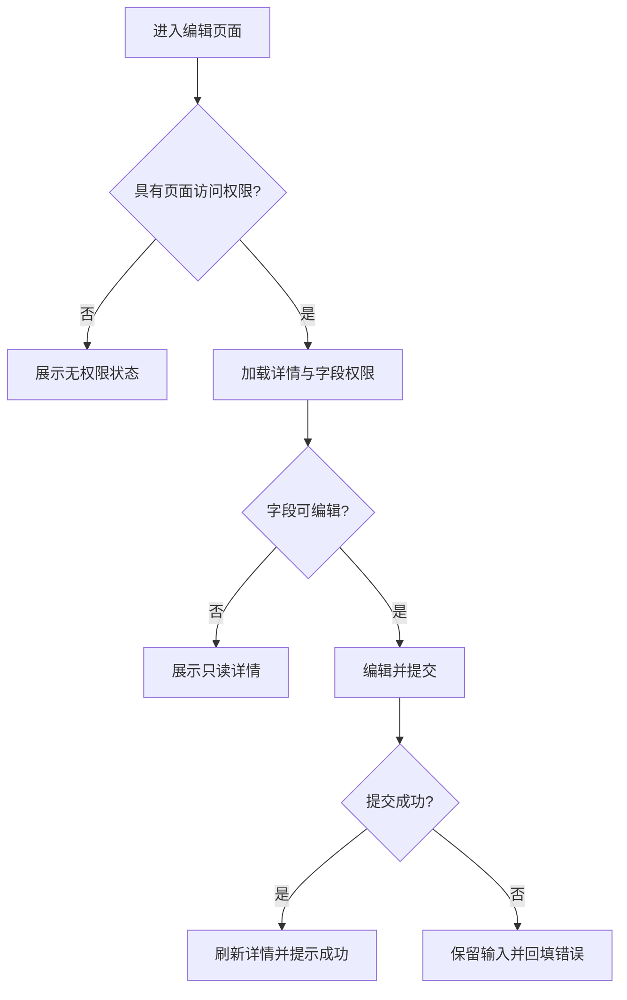
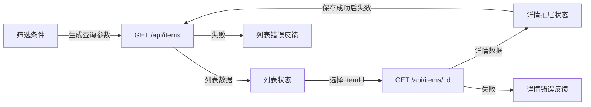
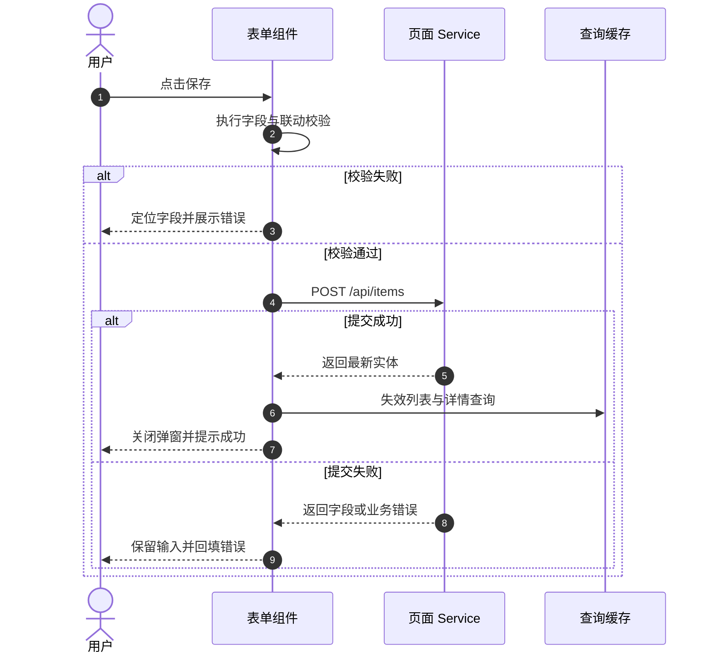
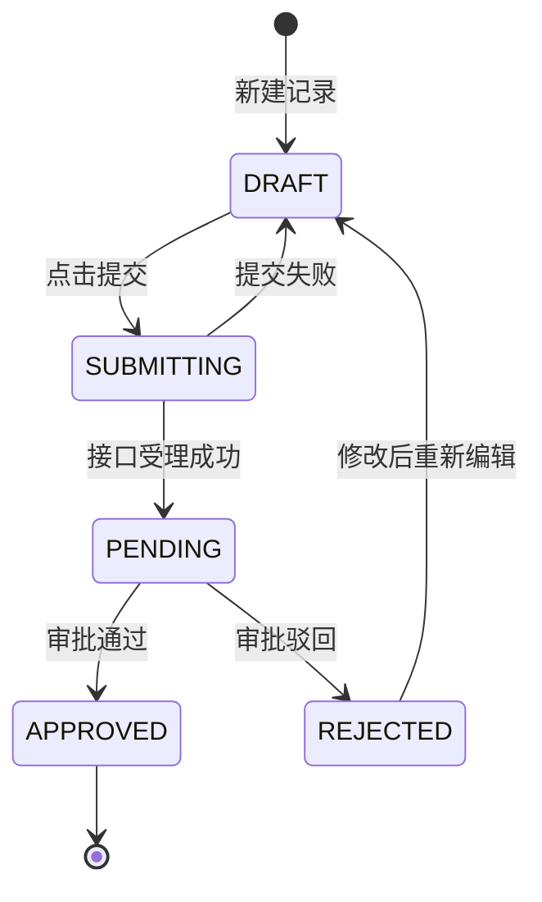
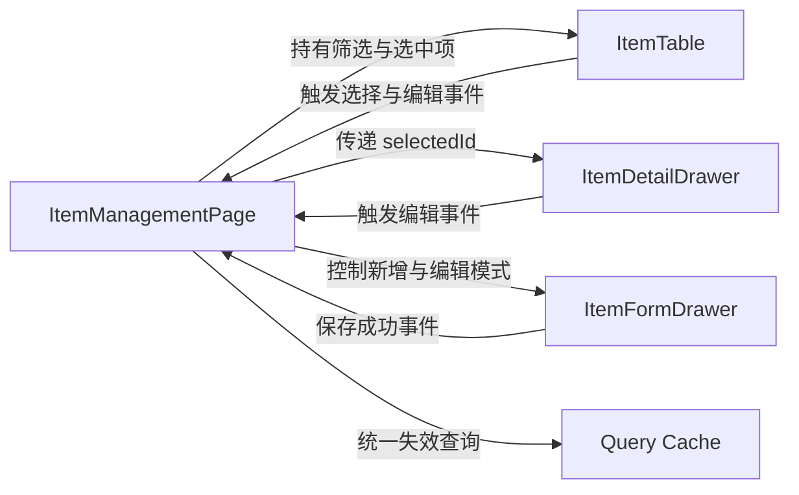
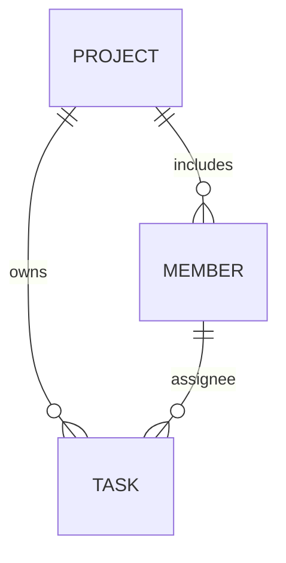

# 前端页面技术方案 Mermaid 规范

本规范服务于 `page-tech.md` 的技术评审，不用于装饰文档。先按 `page-tech.md` 判断是否命中必画或可选场景，再用本文件选择图型、组织内容并完成交付检查。

## 目录

- [选图原则](#选图原则)
- [单图交付契约](#单图交付契约)
- [通用可读性规则](#通用可读性规则)
- [用户流程与权限判断](#用户流程与权限判断)
- [页面数据流](#页面数据流)
- [提交与回滚时序](#提交与回滚时序)
- [业务状态流转](#业务状态流转)
- [组件边界](#组件边界)
- [前端实体关系](#前端实体关系)
- [默认示例图规则](#默认示例图规则)
- [飞书交付](#飞书交付)
- [生成前自检](#生成前自检)

## 选图原则

先明确评审人需要通过图确认的问题，再选择图型：

| 评审问题 | 图型 | 主要落点 |
| --- | --- | --- |
| 用户如何经过多个步骤、分支或页面完成任务 | `flowchart TD` | `3.2 用户流程` / `3.3 关键交互` |
| 权限如何影响入口、按钮、字段或最终操作 | `flowchart TD` | `7.2 权限与安全` |
| 多个接口、页面状态和刷新动作如何传递数据 | `flowchart LR` | `5.6 数据流` |
| 校验、提交、刷新、错误回填或回滚如何依次发生 | `sequenceDiagram` | `5.6 数据流` / `5.7 提交表单与校验` |
| 业务状态之间允许怎样转换 | `stateDiagram-v2` | `5.5 状态设计` |
| 哪些组件拥有状态、触发事件或承担接口职责 | `flowchart LR` | `5.4 组件拆分` |
| 前端规范化缓存中的实体如何关联 | `erDiagram` | `4. 数据与接口` / `5.5 状态设计` |

同一评审问题只保留一张主图。多个必画条件能够在一张图中清楚回答时允许合并；合并后超过 10 个主要节点或 15 条主要连线时按问题拆分。普通页面通常控制在 1–3 张图，不设置绝对上限。

两个及以上接口按“HTTP 方法 + 规范化路径”去重。同一个接口在功能映射、接口说明和数据流章节中重复出现，仍只算一个接口；不同方法的同一路径算不同接口。

## 单图交付契约

每张正式 Mermaid 图必须按以下结构交付：

1. **图示目标**：一句话说明要回答的评审问题。
2. Mermaid 源码：使用当前页面的真实业务节点、状态、接口和动作。
3. **关键结论 / 不变量**：至少一条 bullet，固定数据所有权、刷新范围、状态约束、权限边界或失败恢复规则。

“图示目标”和“关键结论 / 不变量”只能服务紧邻的图，不得跨章节或跨图借用。无法从 PRD、接口或仓库事实确认的节点写入待确认项，不得补造到图中。

## 通用可读性规则

- 节点使用短业务语义；接口路径、组件名或状态码只在有助于评审时补充。
- 连线标注数据、动作、事件或条件，不使用无信息量的“调用”“处理”“返回”。
- 页面展示状态与业务状态分开建模。loading、空数据、请求失败和无权限可以出现在数据流中，但不自动视为业务状态机。
- 组件图表达状态、事件和职责边界，不重复目录树或页面区域清单。
- ER 图只表达前端拥有的规范化缓存或本地实体关系，不复刻后端数据库设计。
- 使用稳定 Mermaid 语法，不依赖图标、HTML label、init 配置或实验图型。

推荐语义色：蓝色表示入口或主状态，黄色表示处理中，绿色表示成功或已同步，红色表示失败或回滚，紫色表示异步或缓存，灰色表示外部依赖。

## 用户流程与权限判断

用于超过四个关键步骤的用户流程、跨页面分支，以及权限影响入口、按钮、字段展示或操作结果的场景。

**图示目标**：说明用户在权限约束下如何完成编辑并获得结果反馈。

**关键结论 / 不变量**

- 页面访问权限、字段编辑权限和提交结果分别处理，禁止用隐藏按钮替代接口权限校验。

## 页面数据流

用于两个及以上接口、接口依赖顺序、多查询刷新、派生展示或缓存失效场景。

**图示目标**：说明筛选条件、列表接口、详情接口和页面状态之间的数据依赖。

**关键结论 / 不变量**

- 详情保存只失效受影响的列表与详情查询，不清空无关页面状态。

## 提交与回滚时序

用于同时包含前端校验、接口提交、结果刷新和错误回填的提交链路。

**图示目标**：说明表单提交成功与失败时的状态、刷新和错误恢复顺序。

**关键结论 / 不变量**

- 提交失败时不得清空用户输入；成功后只刷新受本次写入影响的查询。

## 业务状态流转

用于超过四类页面业务状态，或状态之间存在明确合法转换的场景。不要仅用 normal、loading、empty、error、forbidden 组成业务状态机。

**图示目标**：说明记录从草稿到提交、通过、驳回和再次编辑的合法转换。

**关键结论 / 不变量**

- 只有草稿和驳回状态允许编辑；接口失败必须回到可恢复状态。

## 组件边界

用于多个页面区域之间存在共享状态、跨组件事件或明确的数据所有权，不用于重复目录树。

**图示目标**：说明页面容器、列表、详情和表单之间的状态与事件边界。

**关键结论 / 不变量**

- 页面容器拥有跨区域状态，局部组件只上报事件，不直接修改其他组件状态。

## 前端实体关系

仅当前端确实维护规范化实体缓存，且实体基数和引用关系需要评审时使用。后端表结构、主外键和数据库索引仍由后端技术方案负责。

**图示目标**：说明前端规范化缓存中项目、成员和任务实体的引用关系。

**关键结论 / 不变量**

- 页面状态只保存实体 ID，实体内容由统一缓存维护，避免多个组件持有不一致副本。

## 默认示例图规则

`templates/page-tech.md` 必须保留“用户操作 → 页面状态 → 接口请求 → 页面展示”的默认图，作为 `5.6 数据流` 的结构示例。

- 命中任一必画场景时，替换默认节点、连线和结论，使用当前页面的真实语义。
- 未命中任何必画场景时，可以删除默认图，并填写非空的 **无需配图原因**。
- 正式方案不得原样保留默认节点组合；有 Mermaid 图和无需配图原因时只能保留一种。

## 飞书交付

- Markdown 文档中保留 Mermaid 源码，便于审核和修改。
- 用户要求发布到飞书时，先生成完整 Markdown，再执行项目已有的飞书发布流程。
- 需要把图渲染成飞书画板或图片时，只调用当前环境实际可用且已授权的飞书文档或画板能力。
- 当前环境没有渲染能力时，保留 Mermaid 源码并明确“未渲染”；不得声称图形产物已生成。

## 生成前自检

- 是否逐项核对 `page-tech.md` 的必画条件？
- 两个及以上接口是否按唯一的“方法 + 路径”判断，而不是按文本出现次数判断？
- 默认示例图是否已经替换为当前页面的真实业务语义？
- 每张图是否都有紧邻的图示目标和关键结论？
- 图是否回答了正文或表格难以清楚表达的评审问题？
- 页面展示状态、业务状态、组件状态和缓存状态是否被正确区分？
- 图中的接口、组件、权限和状态是否都有 PRD、接口或仓库证据？
- Mermaid 类型和语法是否通过检查？
