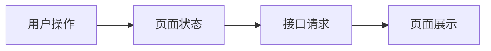

# 页面开发技术方案：{页面名称}

## 1. 背景与目标

## 2. 页面范围

### 2.1 页面入口

### 2.2 页面结构

### 2.3 页面状态

### 2.4 非目标范围

## 3. 需求拆解

### 3.1 功能与接口映射

| 功能 | PRD 交互项 | 接口 | 入参 | 响应数据 | 页面展示 / 行为 | 状态变化 | 成功后刷新 | 异常反馈 |
| ---- | ---------- | ---- | ---- | -------- | --------------- | -------- | ---------- | -------- |

### 3.2 用户流程

### 3.3 关键交互

| PRD 交互项 | 触发条件 | 前端行为 | 接口或状态影响 | 用户反馈 | 待确认 |
| ---------- | -------- | -------- | -------------- | -------- | ------ |

## 4. 数据与接口

### 4.1 依赖数据

### 4.2 接口补充说明

### 4.3 请求参数

### 4.4 响应数据

### 4.5 异常处理

## 5. 前端实现方案

### 5.1 目录结构与产物路径

### 5.2 可复用资源清单

### 5.3 UI 库组件清单

### 5.4 组件拆分

### 5.5 状态设计

### 5.6 数据流

<!-- 方案 A：命中必画条件时保留 Mermaid，并把默认节点、连线、目标和结论替换为当前页面的真实业务语义。 -->

**图示目标**：展示用户操作如何触发页面状态、接口请求与结果展示；正式方案必须改写为当前页面的具体评审问题。

**关键结论 / 不变量**

- 正式方案必须替换为当前页面真实的数据所有权、刷新范围或失败恢复规则。

<!-- 方案 B：未命中任何必画条件时删除方案 A，仅保留并填写下面一行。方案 A 与方案 B 不得同时出现在正式方案中。 -->

**无需配图原因**：<说明为什么正文和表格已经足以完成数据流评审>

### 5.7 提交表单与校验（如涉及）

## 6. UI 与体验约束

### 6.1 设计稿信息

### 6.2 响应式要求

### 6.3 Loading 状态

### 6.4 空状态

### 6.5 错误反馈

## 7. 非功能性设计

### 7.1 性能设计

### 7.2 权限与安全

### 7.3 可访问性

### 7.4 埋点与监控

### 7.5 可维护性

### 7.6 可测试性

## 8. 边界场景

## 9. 完成标准

## 10. 风险与待确认项

### 10.1 风险项

#### PRD / 接口 / 仓库 / 规范冲突项

| 冲突项 | PRD 描述 | 接口或仓库现状 | 影响 | 建议确认对象 |
| ------ | -------- | -------------- | ---- | ------------ |

### 10.2 待确认问题
