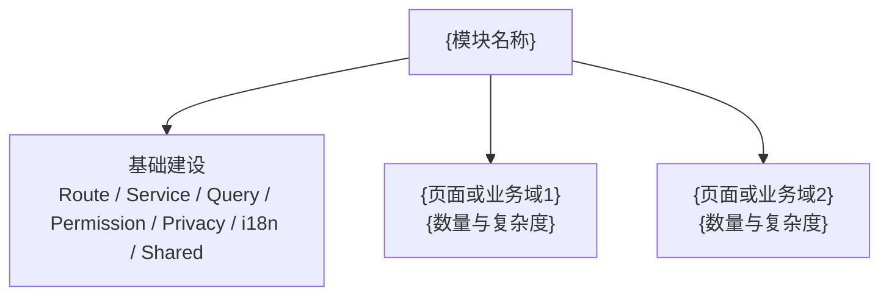
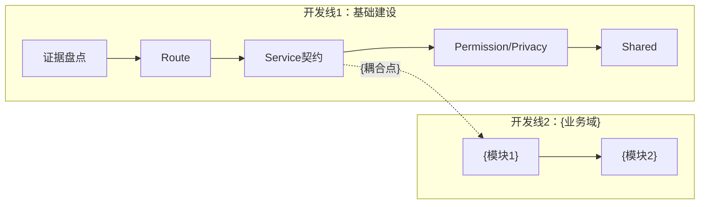

# {模块名称}工作量拆分报告

> 评估日期：{YYYY-MM-DD}  
> 需求依据：{PRD 路径或链接}  
> UI 依据：{Figma/正式 UI/参考原型/未提供}  
> API 依据：{Apifox/OpenAPI/后端仓库/现有 Service/未发现}  
> 目标仓库：{仓库路径}  
> 实现标准：{参考模块}

## 1. 总体规模

本期需要建设 **{页面数} 个页面**，包含 **{详情接入点数} 个详情接入点、{Drawer实现数} 套 Drawer、{Modal数} 个 Modal 或确认弹层、{其他开发单元数} 个其他开发单元，共 {核心开发单元数} 个核心开发单元**；其中 **{高复杂度数量} 个属于高或很高复杂度**，主要是 {高复杂度内容}；API 契约完整度为 **{完整域数}/{总域数}**，UI 完整度为 **{完整页面数}/{总页面数}**；PRD 本期待开发项共 {数量} 项，已纳入 {数量} 项、复用 {数量} 项、暂缓 {数量} 项、阻塞 {数量} 项、非本期 {数量} 项。

统计口径：Page、Drawer、Modal 和其他开发单元互不重复；复用组件只统计一次，页面接入工作在对应里程碑中说明。

## 2. 功能拆分

## 3. 开发链路

{用一段话说明可并行内容、必须等待的上游契约和关键耦合点。}

## 4. 交付里程碑

| 里程碑 | 交付内容 | 前置状态 | 单人工时评估 |
| --- | --- | --- | --- |
| M0 {名称} | {页面数、Drawer数、Modal数、其他开发单元数、主要范围和复杂度} | {API、UI、上游数据模型和阻塞状态} |  |

## 5. 前置确认与阻塞项

| 事项 | 当前状态 | 证据 | 影响里程碑 | 处理要求 |
| --- | --- | --- | --- | --- |
| {事项} | {已完整/部分完整/未发现/阻塞} | {实际证据} | {里程碑} | {处理要求} |

